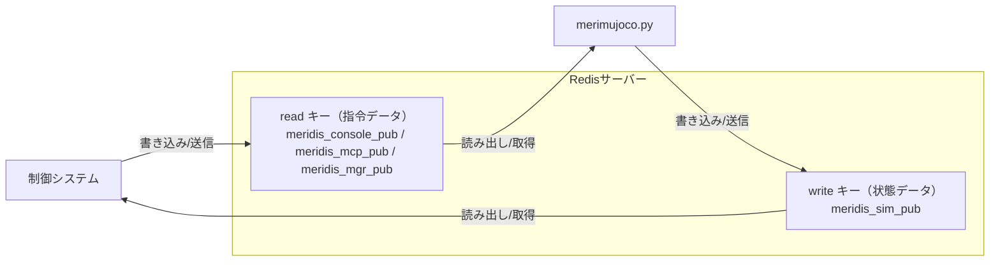

# merimujoco

## 概要

merimujoco は、MuJoCo物理シミュレーションエンジンを使用したロボットシミュレーション・制御システムです。  
Redisを介してロボット制御システムとの連携を行い、物理シミュレーション環境でのロボット動作検証を可能にします。


## 主な機能

- **MuJoCo物理シミュレーション**  
  高精度な物理演算による3Dロボットシミュレーション環境

- **Redis連携**  
  Redis経由でのロボット制御データ・状態データの送受信

- **IMUシミュレーション**  
  シミュレーション内ロボットの姿勢・角速度・加速度をIMUデータとして算出・送信

- **関節制御**  
  Redisから受信した関節角度指令値をシミュレーション内ロボットに適用

- **リセット機能**  
  Redis経由でのシミュレーションリセット（data[0]=5556受信時）

- **リアルタイム制御**  
  専用スレッドによる高頻度データ処理（制御・送受信）

## 利用方法

### 1. 必要なパッケージのインストール

```bash
pip install mujoco numpy redis
```

### 2. シミュレーションの起動

```bash
# デフォルト設定で起動（redis.json使用）
python merimujoco.py

# 別のRedis設定ファイルを指定して起動
python merimujoco.py --redis redis-console.json
python merimujoco.py --redis redis-mcp.json
python merimujoco.py --redis redis-mgr.json
python merimujoco.py --redis redis-mgr-direct.json
```

- MuJoCoビューワーが起動し、3Dロボットシミュレーションが開始されます
- 設定ファイルからRedis設定を自動読み込みします

#### ⚠️ 重要：終了方法

**必ずMuJoCoビューワーウィンドウの右上の「×」ボタン（QUIT）で終了してください。**

- ❌ **非推奨**: ターミナルでのCtrl+C / Ctrl+Z（強制終了）
- ✅ **推奨**: ビューワーウィンドウの×ボタンまたはEscキー

強制終了するとリソースが適切に解放されず、次回起動時に問題が発生する可能性があります。

#### コマンドラインオプション

- `--redis <ファイル名>`: Redis設定JSONファイルを指定（デフォルト: `redis.json`）

```bash
# 例: コンソール用設定で起動
python merimujoco.py --redis redis-console.json
```

### 3. Redis設定ファイル

Redis接続設定をJSONファイルで管理します。ファイルが存在しない場合はデフォルト値（127.0.0.1:6379）を使用します。

#### 設定ファイルの種類

プロジェクトには複数のRedis設定ファイルが用意されており、異なる制御システムとの連携に対応しています：

- **redis.json**: デフォルト設定（マネージャーシステム用、`meridis_mgr_pub`）
- **redis-console.json**: コンソール制御システム用（`meridis_console_pub`）
- **redis-mcp.json**: MCPサーバー用（`meridis_mcp_pub`）
- **redis-mgr.json**: マネージャーシステム用（`meridis_mgr_pub`）
- **redis-mgr-direct.json**: MuJoCoビューアーでの関節操作をRedisに反映（マネージャーシステム用、`meridis_mgr_pub`、`joint_to_redis: true`）

#### 設定ファイルの形式

```json
{
  "redis": {
    "host": "127.0.0.1",
    "port": 6379
  },
  "redis_keys": {
    "read": "meridis_console_pub",
    "write": "meridis_sim_pub"
  },
  "data_flow": {
    "redis_to_joint": true,
    "joint_to_redis": false
  }
}
```

##### 設定項目

- **redis**: Redisサーバーの接続情報
  - `host`: Redisサーバーのホスト名またはIPアドレス
  - `port`: Redisサーバーのポート番号
- **redis_keys**: データ交換用のRedisキー
  - `read`: 制御システムからの指令データを読み取るキー
  - `write`: シミュレーション状態データを書き込むキー
- **data_flow**: データフローの制御 **[試験中]**
  - `redis_to_joint`: Redisから受信した値をMuJoCoの関節にセット (デフォルト: `true`)
  - `joint_to_redis`: MuJoCoの関節角度をRedisに送信 (デフォルト: `false`)

**注意**: `data_flow`設定は現在試験中の機能です。本番環境での使用前に十分なテストを行ってください。

各ファイルは異なる`read`キー（受信用）を使用し、同じ`write`キー（送信用）を共有することで、複数の制御システムからシミュレータを制御できます。

## Redisキーの役割

- **read キー** (`meridis_*_pub`) … 制御システムからシミュレーションに送信される指令データ（関節角度等）を格納するキー（読み取り専用）
- **write キー** (`meridis_sim_pub`) … シミュレーションから制御システムに送信される状態データ（IMU、関節状態等）を格納するキー（書き込み専用）

この2つのキーを通じて、制御システムとシミュレーション間でリアルタイムデータ交換を行います。

### 関係図（Mermaid）



## ファイル構成

- `merimujoco.py` ... MuJoCoシミュレーションメイン・制御・Redis連携
- `redis.json` ... Redis接続設定ファイル（デフォルト・マネージャー用）
- `redis-console.json` ... Redis接続設定ファイル（コンソール制御用）
- `redis-mcp.json` ... Redis接続設定ファイル（MCPサーバー用）
- `redis-mgr.json` ... Redis接続設定ファイル（マネージャーシステム用）
- `redis-mgr-direct.json` ... Redis接続設定ファイル（MuJoCoビューアーでの関節操作をRedisに反映・マネージャーシステム用）
- `mjcf/scene.xml` ... ロボットモデル・シミュレーション環境定義（MJCF形式）
- `urdf/scene.xml` ... ロボットモデル・シミュレーション環境定義（URDF形式）
- `redis_receiver.py` ... Redisからのデータ受信モジュール
- `redis_transfer.py` ... Redisへのデータ送信モジュール
- `README.md` ... このファイル

---

## merimujoco.py

- `merimujoco.py` は MuJoCo 物理エンジンを使用した3Dロボットシミュレーションシステムです。
- Redis を介して外部制御システム（mcp-meridisなど）との連携を行います。
- 高精度なIMUシミュレーション、関節制御、リアルタイムデータ交換を提供します。

### 使い方

```bash
# デフォルト設定で起動
python merimujoco.py

# 特定のRedis設定を使用
python merimujoco.py --redis redis-console.json

# MCP用設定で起動（redis-mcp.jsonでdata_flowを設定）
python merimujoco.py --redis redis-mcp.json
```

### コマンドラインオプション

- `--redis <ファイル名>`: Redis設定JSONファイルを指定（デフォルト: `redis.json`）

データフローの制御（`redis_to_joint`, `joint_to_redis`）は、各Redis設定ファイルの`data_flow`ブロックで設定します。

### 設定ファイル

### 設定ファイル

Redis接続設定を JSON ファイルで管理します。ファイルが存在しない場合は安全なデフォルト値（127.0.0.1:6379）を使用します。

#### 利用可能な設定ファイル

- **redis.json**: デフォルト設定（`meridis_mgr_pub` → `meridis_sim_pub`）
- **redis-console.json**: コンソール制御用（`meridis_console_pub` → `meridis_sim_pub`）
- **redis-mcp.json**: MCPサーバー用（`meridis_mcp_pub` → `meridis_sim_pub`）
- **redis-mgr.json**: マネージャー用（`meridis_mgr_pub` → `meridis_sim_pub`）

#### 設定ファイル形式

```json
{
  "redis": {
    "host": "127.0.0.1",
    "port": 6379
  },
  "redis_keys": {
    "read": "meridis_console_pub",
    "write": "meridis_sim_pub"
  }
}
```

### 動作

- **起動時処理**: Redis設定ファイルを読み込み、MuJoCoモデル（scene.xml）をロード、ビューワーを起動します。
- **物理シミュレーション**: 1ms間隔でMuJoCo物理演算を実行（重力、摩擦、関節動力学）
- **制御スレッド**: 専用スレッドでRedis経由の指令受信・状態送信を高頻度実行
- **IMU計算**: c_chest座標系でのロボット姿勢（Roll/Pitch/Yaw）、角速度、加速度を算出

### シミュレーション機能

#### 物理パラメータ
- **重力**: -9.8 m/s² （Z軸方向）
- **タイムステップ**: 0.001秒 （1ms間隔）
- **積分器**: RK4（高精度・安定）
- **関節減衰**: 5.0 （振動抑制）
- **摩擦係数**: 静止摩擦 1.2、動摩擦 0.8、粘着摩擦 0.01

#### IMUシミュレーション
- **姿勢**: c_chest座標系のRoll/Pitch/Yaw角度（度）
- **角速度**: 各軸回りの角速度（度/秒）
- **加速度**: 重力ベクトルの座標変換による線形加速度（m/s²）

#### 関節制御
- **制御対象**: 主要関節（股関節、膝関節、足首関節、頭部、肩関節等）
- **指令値**: Redisから受信した角度指令（度→ラジアン変換）
- **制御方式**: 位置制御（PD制御相当）

### データフロー

```
制御システム → Redis[read key] → merimujoco.py → MuJoCo物理演算 → IMU/関節状態 → Redis[write key] → 制御システム
```

- **read キー** (`meridis_*_pub`): 外部制御システムからの関節角度指令、制御コマンド
- **write キー** (`meridis_sim_pub`): シミュレーション結果のIMUデータ、関節状態、システム応答

### 特殊機能

#### リセット機能
- **条件**: Redis経由で `data[0] == 5556` を受信
- **動作**: MuJoCoシミュレーション状態を初期化（mj_resetData）
- **用途**: 制御実験の初期化、異常状態からの復旧

#### 関節マッピング
##### joint_names[] と XMLファイルのjoint名
- **概要**: `merimujoco.py` の `joint_names` リストは、MuJoCoモデルのactuator順序に基づいてインデックス付けされた関節名を定義しています。
- **注意点**: 読み込む `roid1_mjcf.xml` のjoint名と `joint_names[]` が一致しない場合でも、MuJoCo の `data.ctrl` はモデルのactuator順序に基づいてインデックス付けされることから、`joint_names` リストの順序がXMLファイルのactuator順序と一致していれば、問題なく扱えます。
- **推奨**: 可読性のためには、`joint_names[]` リストの関節名をXMLファイルのjoint名と一致させることを推奨します。

```python
joint_names = [
    "c_chest", "c_head", "l_shoulder_pitch", "l_shoulder_roll", "l_elbow_yaw", "l_elbow_pitch",
    "r_shoulder_pitch", "r_shoulder_roll", "r_elbow_yaw", "r_elbow_pitch",
    "l_hip_yaw", "l_hip_roll", "l_thigh_pitch", "l_knee_pitch", "l_ankle_pitch", "l_ankle_roll",
    "r_hip_yaw", "r_hip_roll", "r_thigh_pitch", "r_knee_pitch", "r_ankle_pitch", "r_ankle_roll"
]
```
##### joint_to_meridis[] と meridis_sim_pub テーブル
- **概要**: `joint_to_meridis` 辞書は、各関節名をMeridisデータ配列のインデックスと乗数にマッピングします。
これにより、Redisから受信した関節角度データを適切に変換してMuJoCoの`data.ctrl`に適用できます。
- **構造**: 各エントリは `[インデックス, 乗数]` の形式です
  - インデックスはMeridis配列の位置
  - 乗数は符号反転などの調整
- **用途**: Redis経由のデータ交換で、外部制御システムの指令値をシミュレーション内の関節制御に変換します。

```python
joint_to_meridis = {
    # Base link
    "base_roll":        [12, 1],
    "base_pitch":       [13, 1],
    "base_yaw":         [14, 1],
    # Head
    "c_head":           [21, 1],
    # Left arm
    "l_shoulder_pitch": [23, 1],
    "l_shoulder_roll":  [25, 1],
    "l_elbow_yaw":      [27, 1],
    "l_elbow_pitch":    [29, 1],
    # Left leg
    "l_hip_yaw":        [31, 1],
    "l_hip_roll":       [33, 1],
    "l_thigh_pitch":    [35, 1],
    "l_knee_pitch":     [37, 1],
    "l_ankle_pitch":    [39, 1],
    "l_ankle_roll":     [41, 1],
    # chest
    "c_chest":          [51, 1],
    # Right arm
    "r_shoulder_pitch": [53, 1],
    "r_shoulder_roll":  [55,-1],
    "r_elbow_yaw":      [57,-1],
    "r_elbow_pitch":    [59, 1],
    # Right leg
    "r_hip_yaw":        [61,-1],
    "r_hip_roll":       [63,-1],
    "r_thigh_pitch":    [65, 1],
    "r_knee_pitch":     [67, 1],
    "r_ankle_pitch":    [69, 1],
    "r_ankle_roll":     [71,-1]
}
```

### 注記

- シミュレーション精度は物理パラメータ設定に依存します
- Redis接続エラー時も安全にシミュレーションを継続します
- 制御データの送受信は独立スレッドで実行され、シミュレーションループをブロックしません
- IMU計算は胸部リンク（c_chest）の運動学的状態から高精度に算出されます
- 関節角度の単位変換（度↔ラジアン）、座標系変換は自動処理されます
- プログラム終了時にGLFWライブラリのクリーンアップを行い、エラーを回避します

### 例

```bash
# デフォルト設定でシミュレーション起動
python merimujoco.py

# コンソール制御システム用設定で起動
python merimujoco.py --redis redis-console.json

# MCP制御システム用設定で起動
python merimujoco.py --redis redis-mcp.json
```

実装の詳細については [merimujoco.py](merimujoco.py) を参照してください（関節マッピング、IMU計算、Redis連携、制御スレッドなど）。
