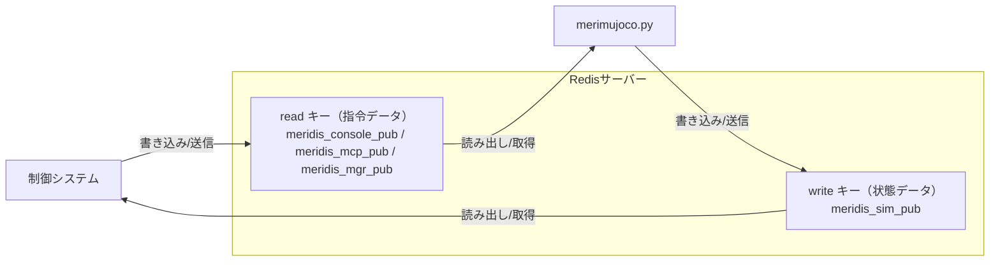

# merimujoco

## 背景・目的

### フィジカルAI・エンボディードAIの潮流

近年、大規模言語モデル（LLM）の進化を背景に、AIが身体性を持ち物理世界で行動する **フィジカルAI**・**エンボディードAI** が急速に注目を集めています。ロボットが実環境で自律的に動作するためには、物理法則に基づいた高精度なシミュレーション環境が不可欠であり、**シミュレーション技術** がこの分野の研究開発の鍵を握っています。


## 概要

本リポジトリの**merimujoco**は、物理シミュレーションエンジン`MuJoCo`を使用したロボットシミュレーションシステムです。

merimujocoは外部システムとのデータ送受信において、柔軟なデータ構造かつ高速なインメモリデータベース`Redis`を使用する**meridis**モジュールとの連動で、**外部システム**との円滑な連携の実現を特長としています。

## 主な機能

- **MuJoCo物理シミュレーション**
  高精度な物理演算を備えた3Dロボットシミュレーション環境を提供する

- **リアルタイム制御**  
  専用スレッドによる最大100Hzの高頻度でデータ処理する

- **Redis経由のデータ処理（meridisモジュール）**
  インメモリデータベースRedis経由でロボット制御データ・状態データを送受信する

  - **Sim2Real**<br>
  リアルロボットの制御システムと連携することで、シミュレーションロボットとリアルロボットの関節の動きを同期・遠隔制御する

  - **Real2Sim**<br>
  リアルロボットの制御システムと連携することで、リアルロボットの関節の動きをシミュレーションロボットで再現する

  - **動作生成プログラム**<br>
  論文研究をベースとした動作生成プログラムの演算結果を入力として、シミュレーション上で再生し動作検証する

  - **MCPサーバー（予約）**<br>
  MCPサーバーと連携することで、AIエージェントからの指令をトリガとして、シミュレーションロボットの制御データ・状態データを送受信できる

- **リセット機能**  
  与えるデータ先頭 data[0]=5556 とするとき、Mujocoのシミュレーション環境をリセットし初期条件に戻すことができる

- **マルチプラットフォーム**
  本プログラムは、Linux/WSL/Windows11/MacOS で動作確認済です。

### MuJoCo の選定理由

数あるロボットシミュレータの中で **MuJoCo（Multi-Joint dynamics with Contact）** が広く選ばれています

- **高速・高精度な接触演算**: 多関節ロボットの接触力学を正確かつ高速に計算でき、歩行・把持など複雑なタスクに対応
- **研究コミュニティとの親和性**: DeepMind による OSS 化以降、強化学習・運動制御の研究論文で事実上の標準シミュレータとして採用が急増
- **軽量・高い拡張性**: CPU のみで動作する軽量設計でノートPCでも手軽に実行可能。さらに **NVIDIA Warp** などGPU並列化技術を活用することで数百倍の高速化を実現でき、大規模強化学習や並列シミュレーションにも対応
- **最新ロボティクスAIとの統合**: **NVIDIA Isaac Sim/Lab**、**Genesis** などの次世代ロボティクスプラットフォームが MuJoCo をコアエンジンとして採用しており、強化学習ライブラリとシームレスに連携可能。論文で発表された最新アルゴリズムを即座に実装・検証できる
- **優れたビルトインUI**: インタラクティブなビューワーが標準搭載され、マウスでの直感的なカメラ操作、スライダーによる関節角度調整、物理パラメータのリアルタイム表示など、デバッグと開発効率を大幅に向上させる機能が提供されている


## セットアップ

merimujoco は **Redis経由でデータ処理** を前提に設計されているため、最初に **meridisモジュール** のセットアップが必要です。

### ステップ1: meridisモジュールのセットアップ ⭐ **必須**

merimujoco の **Redis経由のデータ処理** を利用するために、事前に**meridisモジュール**をセットアップしてください：

[meridis マニュアル](https://github.com/holypong/meridis/blob/main/README.md)

**必要な作業:**
- ✅ Redis サーバーのインストールと起動確認
- ✅ meridisリポジトリのダウンロード
- ✅ 必要なPython依存パッケージのインストール
- ✅ Redisキー初期化
- ✅ ネットワーク設定の確認
---

### ステップ2: Merimujoco のインストール

meridis のセットアップが完了したら、merimujoco をインストールします。

#### 必要なパッケージのインストール

```bash
pip install mujoco numpy redis
```


---

## クイックスタート 🚀

セットアップ完了後、以下の手順で基本的な動作確認を行いましょう。

### 🎯 Step 1: 基本動作確認（シミュレーションのみ）

まず merimujoco 単体での動作を確認します：

```bash
# デフォルト設定で起動テスト
python merimujoco.py
```


**✅ 成功確認:**
- MuJoCoビューワーウィンドウが開いている
- シミュレーションロボットが表示されている  
- マウスのドラッグ操作ででカメラ操作ができる
  - L-Button: 左右上下回転
  - R-Button: 左右上下移動
  - M-Button: 前後移動
- 左メニュー `Option`->`Font` 100% でメニューサイズを調整する
- →メニュー `Control`で任意の関節をL-Buttonドラッグ操作する

**⚠️ 重要：merimujoco 終了方法**  
**ウィンドウ右上の「×」ボタン、または左メニュー `File`->`Quit`で終了してください。**


### 🔗 Step 2: Redis連携の動作確認

次にRedis経由でのデータ交換を確認します：

```bash
# ターミナル1: シミュレーション起動
python merimujoco.py --redis redis-mgr-direct.json

# ターミナル2: リアルタイム可視化（別ターミナルで）
cd ../meridis
python redis_plotter.py --redis-key meridis_sim_pub --display joint
```


**✅ 成功確認:**
- シミュレーションとグラフの両方が表示される
- MuJoCo内でロボットを動かすとグラフにデータが反映される

### 🤖 Step 3: シミュレーション→実機連携（実機がある場合）

**事前準備:** [meridis/README.md - ネットワーク設定](../meridis/README.md#ネットワーク設定)を参照してネットワーク設定を確認してください。

```bash
# ターミナル1: シミュレーション起動
python merimujoco.py --redis redis-calc.json

# ターミナル2: モーション生成（meridisディレクトリで）
cd ../meridis
python meridis_motion_calc.py

# ターミナル3: 実機ブリッジ（meridisディレクトリで）
python meridis_manager.py --mgr mgr_sim2real.json
```

**✅ 成功確認:**
- シミュレーション内でロボットが動作
- 同じ動きが実機でも再現される

### ❓ うまく動かない場合

**Redis接続エラー:** 
→ [meridis/README.md - Redis動作確認](../meridis/README.md#redis-動作確認)をご確認ください

**実機連携エラー:**  
→ [meridis/README.md - ネットワーク設定](../meridis/README.md#ネットワーク設定)をご確認ください

**その他:** 
→ [開発者向け情報](#開発者向け情報)で詳細なライブラリ使用法をご確認ください

---

## 詳細設定

### 3. Redis設定ファイル

Redis接続設定をJSONファイルで管理します。ファイルが存在しない場合はデフォルト値（127.0.0.1:6379）を使用します。

#### 設定ファイルの種類

プロジェクトには複数のRedis設定ファイルが用意されており、異なる制御システムとの連携に対応しています：

- **redis.json**: デフォルト設定（マネージャーシステム用、`meridis_mgr_pub`）
- **redis-console.json**: コンソール制御システム用（`meridis_console_pub`）
- **redis-mcp.json**: MCPサーバー用（`meridis_mcp_pub`）
- **redis-mgr.json**: マネージャーシステム用（`meridis_mgr_pub`）
- **redis-mgr-direct.json**: MuJoCoビューアーでの関節操作をRedisに反映（マネージャーシステム用、`meridis_mgr_pub`、`joint_to_redis: true`）

#### 設定ファイルの形式

```json
{
  "redis": {
    "host": "127.0.0.1",
    "port": 6379
  },
  "redis_keys": {
    "read": "meridis_console_pub",
    "write": "meridis_sim_pub"
  },
  "data_flow": {
    "redis_to_joint": true,
    "joint_to_redis": false
  }
}
```

##### 設定項目

- **redis**: Redisサーバーの接続情報
  - `host`: Redisサーバーのホスト名またはIPアドレス
  - `port`: Redisサーバーのポート番号
- **redis_keys**: データ交換用のRedisキー
  - `read`: 制御システムからの指令データを読み取るキー
  - `write`: シミュレーション状態データを書き込むキー
- **data_flow**: データフローの制御 **[試験中]**
  - `redis_to_joint`: Redisから受信した値をMuJoCoの関節にセット (デフォルト: `true`)
  - `joint_to_redis`: MuJoCoの関節角度をRedisに送信 (デフォルト: `false`)

**注意**: `data_flow`設定は現在試験中の機能です。本番環境での使用前に十分なテストを行ってください。

各ファイルは異なる`read`キー（受信用）を使用し、同じ`write`キー（送信用）を共有することで、複数の制御システムからシミュレータを制御できます。

### コマンドラインオプション

- `--redis <ファイル名>`: Redis設定JSONファイルを指定（デフォルト: `redis.json`）

```bash
# 例: コンソール用設定で起動
python merimujoco.py --redis redis-console.json

# 例: MCP用設定で起動
python merimujoco.py --redis redis-mcp.json
```

データフローの制御（`redis_to_joint`, `joint_to_redis`）は、各Redis設定ファイルの`data_flow`ブロックで設定します。

---

## 技術詳細 📋

### Redisキーの役割

- **read キー** (`meridis_*_pub`) … 制御システムからシミュレーションに送信される指令データ（関節角度等）を格納するキー（読み取り専用）
- **write キー** (`meridis_sim_pub`) … シミュレーションから制御システムに送信される状態データ（IMU、関節状態等）を格納するキー（書き込み専用）

この2つのキーを通じて、制御システムとシミュレーション間でリアルタイムデータ交換を行います。

### 関係図（Mermaid）



## ファイル構成

- `merimujoco.py` ... MuJoCoシミュレーションメイン・制御・Redis連携
- `redis.json` ... Redis接続設定ファイル（デフォルト・マネージャー用）
- `redis-console.json` ... Redis接続設定ファイル（コンソール制御用）
- `redis-mcp.json` ... Redis接続設定ファイル（MCPサーバー用）
- `redis-mgr.json` ... Redis接続設定ファイル（マネージャーシステム用）
- `redis-mgr-direct.json` ... Redis接続設定ファイル（MuJoCoビューアーでの関節操作をRedisに反映・マネージャーシステム用）
- `mjcf/scene.xml` ... ロボットモデル・シミュレーション環境定義（MJCF形式）
- `urdf/scene.xml` ... ロボットモデル・シミュレーション環境定義（URDF形式）
- `redis_receiver.py` ... Redisからのデータ受信モジュール
- `redis_transfer.py` ... Redisへのデータ送信モジュール
- `README.md` ... このファイル

---

## merimujoco.py

- `merimujoco.py` は MuJoCo 物理エンジンを使用した3Dロボットシミュレーションシステムです。
- Redis を介して外部制御システム（mcp-meridisなど）との連携を行います。
- 高精度なIMUシミュレーション、関節制御、リアルタイムデータ交換を提供します。

### 使い方

```bash
# デフォルト設定で起動
python merimujoco.py

# 特定のRedis設定を使用
python merimujoco.py --redis redis-console.json

# MCP用設定で起動（redis-mcp.jsonでdata_flowを設定）
python merimujoco.py --redis redis-mcp.json
```

### コマンドラインオプション

- `--redis <ファイル名>`: Redis設定JSONファイルを指定（デフォルト: `redis.json`）

データフローの制御（`redis_to_joint`, `joint_to_redis`）は、各Redis設定ファイルの`data_flow`ブロックで設定します。

### 設定ファイル

### 設定ファイル

Redis接続設定を JSON ファイルで管理します。ファイルが存在しない場合は安全なデフォルト値（127.0.0.1:6379）を使用します。

#### 利用可能な設定ファイル

- **redis.json**: デフォルト設定（`meridis_mgr_pub` → `meridis_sim_pub`）
- **redis-console.json**: コンソール制御用（`meridis_console_pub` → `meridis_sim_pub`）
- **redis-mcp.json**: MCPサーバー用（`meridis_mcp_pub` → `meridis_sim_pub`）
- **redis-mgr.json**: マネージャー用（`meridis_mgr_pub` → `meridis_sim_pub`）

#### 設定ファイル形式

```json
{
  "redis": {
    "host": "127.0.0.1",
    "port": 6379
  },
  "redis_keys": {
    "read": "meridis_console_pub",
    "write": "meridis_sim_pub"
  }
}
```

### 動作

- **起動時処理**: Redis設定ファイルを読み込み、MuJoCoモデル（scene.xml）をロード、ビューワーを起動します。
- **物理シミュレーション**: 1ms間隔でMuJoCo物理演算を実行（重力、摩擦、関節動力学）
- **制御スレッド**: 専用スレッドでRedis経由の指令受信・状態送信を高頻度実行
- **IMU計算**: c_chest座標系でのロボット姿勢（Roll/Pitch/Yaw）、角速度、加速度を算出

### シミュレーション機能

#### 物理パラメータ
- **重力**: -9.8 m/s² （Z軸方向）
- **タイムステップ**: 0.001秒 （1ms間隔）
- **積分器**: RK4（高精度・安定）
- **関節減衰**: 5.0 （振動抑制）
- **摩擦係数**: 静止摩擦 1.2、動摩擦 0.8、粘着摩擦 0.01

#### IMUシミュレーション
- **姿勢**: c_chest座標系のRoll/Pitch/Yaw角度（度）
- **角速度**: 各軸回りの角速度（度/秒）
- **加速度**: 重力ベクトルの座標変換による線形加速度（m/s²）

#### 関節制御
- **制御対象**: 主要関節（股関節、膝関節、足首関節、頭部、肩関節等）
- **指令値**: Redisから受信した角度指令（度→ラジアン変換）
- **制御方式**: 位置制御（PD制御相当）

### データフロー

```
制御システム → Redis[read key] → merimujoco.py → MuJoCo物理演算 → IMU/関節状態 → Redis[write key] → 制御システム
```

- **read キー** (`meridis_*_pub`): 外部制御システムからの関節角度指令、制御コマンド
- **write キー** (`meridis_sim_pub`): シミュレーション結果のIMUデータ、関節状態、システム応答

### 特殊機能

#### リセット機能
- **条件**: Redis経由で `data[0] == 5556` を受信
- **動作**: MuJoCoシミュレーション状態を初期化（mj_resetData）
- **用途**: 制御実験の初期化、異常状態からの復旧

#### 関節マッピング
##### joint_names[] と XMLファイルのjoint名
- **概要**: `merimujoco.py` の `joint_names` リストは、MuJoCoモデルのactuator順序に基づいてインデックス付けされた関節名を定義しています。
- **注意点**: 読み込む `roid1_mjcf.xml` のjoint名と `joint_names[]` が一致しない場合でも、MuJoCo の `data.ctrl` はモデルのactuator順序に基づいてインデックス付けされることから、`joint_names` リストの順序がXMLファイルのactuator順序と一致していれば、問題なく扱えます。
- **推奨**: 可読性のためには、`joint_names[]` リストの関節名をXMLファイルのjoint名と一致させることを推奨します。

```python
joint_names = [
    "c_chest", "c_head", "l_shoulder_pitch", "l_shoulder_roll", "l_elbow_yaw", "l_elbow_pitch",
    "r_shoulder_pitch", "r_shoulder_roll", "r_elbow_yaw", "r_elbow_pitch",
    "l_hip_yaw", "l_hip_roll", "l_thigh_pitch", "l_knee_pitch", "l_ankle_pitch", "l_ankle_roll",
    "r_hip_yaw", "r_hip_roll", "r_thigh_pitch", "r_knee_pitch", "r_ankle_pitch", "r_ankle_roll"
]
```
##### joint_to_meridis[] と meridis_sim_pub テーブル
- **概要**: `joint_to_meridis` 辞書は、各関節名をMeridisデータ配列のインデックスと乗数にマッピングします。
これにより、Redisから受信した関節角度データを適切に変換してMuJoCoの`data.ctrl`に適用できます。
- **構造**: 各エントリは `[インデックス, 乗数]` の形式です
  - インデックスはMeridis配列の位置
  - 乗数は符号反転などの調整
- **用途**: Redis経由のデータ交換で、外部制御システムの指令値をシミュレーション内の関節制御に変換します。

```python
joint_to_meridis = {
    # Base link
    "base_roll":        [12, 1],
    "base_pitch":       [13, 1],
    "base_yaw":         [14, 1],
    # Head
    "c_head":           [21, 1],
    # Left arm
    "l_shoulder_pitch": [23, 1],
    "l_shoulder_roll":  [25, 1],
    "l_elbow_yaw":      [27, 1],
    "l_elbow_pitch":    [29, 1],
    # Left leg
    "l_hip_yaw":        [31, 1],
    "l_hip_roll":       [33, 1],
    "l_thigh_pitch":    [35, 1],
    "l_knee_pitch":     [37, 1],
    "l_ankle_pitch":    [39, 1],
    "l_ankle_roll":     [41, 1],
    # chest
    "c_chest":          [51, 1],
    # Right arm
    "r_shoulder_pitch": [53, 1],
    "r_shoulder_roll":  [55,-1],
    "r_elbow_yaw":      [57,-1],
    "r_elbow_pitch":    [59, 1],
    # Right leg
    "r_hip_yaw":        [61,-1],
    "r_hip_roll":       [63,-1],
    "r_thigh_pitch":    [65, 1],
    "r_knee_pitch":     [67, 1],
    "r_ankle_pitch":    [69, 1],
    "r_ankle_roll":     [71,-1]
}
```

### 注記

- シミュレーション精度は物理パラメータ設定に依存します
- Redis接続エラー時も安全にシミュレーションを継続します
- 制御データの送受信は独立スレッドで実行され、シミュレーションループをブロックしません
- IMU計算は胸部リンク（c_chest）の運動学的状態から高精度に算出されます
- 関節角度の単位変換（度↔ラジアン）、座標系変換は自動処理されます
- プログラム終了時にGLFWライブラリのクリーンアップを行い、エラーを回避します

### 例

```bash
# デフォルト設定でシミュレーション起動
python merimujoco.py

# コンソール制御システム用設定で起動
python merimujoco.py --redis redis-console.json

# MCP制御システム用設定で起動
python merimujoco.py --redis redis-mcp.json
```

実装の詳細については [merimujoco.py](merimujoco.py) を参照してください（関節マッピング、IMU計算、Redis連携、制御スレッドなど）。

---

## 開発者向け情報 🛠️

merimujoco をベースとした独自ロボット制御システムの開発を行う際は、**meridis システム** の豊富なライブラリ群を活用することで、効率的な開発が可能です。

### 📚 Meridis ライブラリリファレンス

高度な制御システム開発では、以下のmeridisライブラリを参照してください：

**🔧 コアライブラリ:**
- **redis_transfer.py** - Redisへのデータ書き込み（制御指令送信）
- **redis_receiver.py** - Redisからのデータ読み取り（センサーデータ受信）  
- **meridis_manager.py** - Redis↔UDP双方向ブリッジ（高度な実機連携）

**📊 監視・デバッグツール:**
- **redis_plotter.py** - リアルタイム可視化（関節角度・足部位置）
- **udp_sender.py** - UDP通信のテスト・デバッグ

**⚙️ ユーティリティ:**
- **create_meridis_keys.py** - Redis環境の初期化

**📖 詳細ドキュメント:**  
[meridis/README.md - ライブラリの動作を確認する](../meridis/README.md#ライブラリの動作を確認する)

### 🎯 カスタマイズのポイント

#### 1. 独自制御アルゴリズムの実装
```python
# 例: カスタム制御ループ
from redis_transfer import RedisTransfer
from redis_receiver import RedisReceiver

# 制御指令をRedisに送信
transfer = RedisTransfer(key="meridis_custom_pub")
transfer.set_data(your_control_data)

# シミュレーション結果を取得  
receiver = RedisReceiver(key="meridis_sim_pub")
sensor_data = receiver.get_data()
```

#### 2. 独自ロボットモデルの適用
- **URDFファイル**: `urdf/` ディレクトリに新しいモデルを配置
- **関節マッピング**: `merimujoco.py` の `joint_to_meridis` 辞書を変更
- **物理パラメータ**: MJCFファイルの摩擦係数・慣性モーメント等を調整

#### 3. リアルタイム性能の最適化
- **制御周期**: Redis読み書きのタイムスパンを用途に応じて調整
- **データフィルタリング**: 必要なデータのみを送受信してネットワーク負荷を軽減
- **並列処理**: 複数のRedisキーを使った並列制御

### 🔍 高度な開発パターン

**シミュレーション駆動開発:**
1. merimujoco で動作確認
2. redis_plotter.py でデータ解析  
3. パラメータ調整・最適化
4. meridis_manager.py で実機検証

**チーム開発:**
- 個別のRedisキー（`meridis_dev1_pub` など）で独立作業
- 共通のシミュレーション環境で統合テスト
- redis_plotter.py でチーム内データ共有

### 💡 トラブルシューティング

開発中に問題が発生した場合は、以下のmeridisドキュメントが役立ちます：

- **Redis接続問題:** [Redis動作確認](../meridis/README.md#redis-動作確認)
- **実機連携問題:** [ネットワーク設定](../meridis/README.md#ネットワーク設定) 
- **データフロー理解:** [ロボット動作を管理する](../meridis/README.md#ロボット動作を管理する)
- **可視化・デバッグ:** [ライブラリの動作を確認する](../meridis/README.md#ライブラリの動作を確認する)
