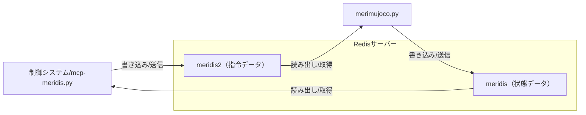

# merimujoco

## 概要

merimujoco は、MuJoCo物理シミュレーションエンジンを使用したロボットシミュレーション・制御システムです。  
Redisを介してロボット制御システムとの連携を行い、物理シミュレーション環境でのロボット動作検証を可能にします。

## 主な機能

- **MuJoCo物理シミュレーション**  
  高精度な物理演算による3Dロボットシミュレーション環境

- **Redis連携**  
  Redis経由でのロボット制御データ・状態データの送受信

- **IMUシミュレーション**  
  シミュレーション内ロボットの姿勢・角速度・加速度をIMUデータとして算出・送信

- **関節制御**  
  Redisから受信した関節角度指令値をシミュレーション内ロボットに適用

- **リセット機能**  
  Redis経由でのシミュレーションリセット（data[0]=5556受信時）

- **リアルタイム制御**  
  専用スレッドによる高頻度データ処理（制御・送受信）

## 利用方法

### 1. 必要なパッケージのインストール

```bash
pip install mujoco numpy redis
```

### 2. シミュレーションの起動

```bash
python merimujoco.py
```

- MuJoCoビューワーが起動し、3Dロボットシミュレーションが開始されます
- 設定ファイル `mujoco-redis.json` からRedis設定を自動読み込みします

### 3. 設定ファイル（mujoco-redis.json）

Redis接続設定をJSONファイルで管理します。ファイルが存在しない場合はデフォルト値（127.0.0.1:6379）を使用します。

```json
{
  "redis": {
    "host": "127.0.0.1",
    "port": 6379
  },
  "redis_keys": {
    "read": "meridis2",
    "write": "meridis"
  }
}
```

## Redisキー `meridis` と `meridis2` の関係

- `meridis2` … 制御システムからシミュレーションに送信される指令データ（関節角度等）を格納するキー（読み取り専用）
- `meridis` … シミュレーションから制御システムに送信される状態データ（IMU、関節状態等）を格納するキー（書き込み専用）

この2つのキーを通じて、制御システムとシミュレーション間でリアルタイムデータ交換を行います。

### 関係図（Mermaid）



## ファイル構成

- `merimujoco.py` ... MuJoCoシミュレーションメイン・制御・Redis連携
- `mujoco-redis.json` ... Redis接続設定ファイル
- `urdf/scene.xml` ... ロボットモデル・シミュレーション環境定義
- `redis_receiver.py` ... Redisからのデータ受信モジュール
- `redis_transfer.py` ... Redisへのデータ送信モジュール
- `README.md` ... このファイル

---

## merimujoco.py

- `merimujoco.py` は MuJoCo 物理エンジンを使用した3Dロボットシミュレーションシステムです。
- Redis を介して外部制御システム（mcp-meridisなど）との連携を行います。
- 高精度なIMUシミュレーション、関節制御、リアルタイムデータ交換を提供します。

### 使い方

```bash
python merimujoco.py
```

### 設定ファイル（mujoco-redis.json）

Redis接続設定を JSON ファイルで管理します。ファイルが存在しない場合は安全なデフォルト値（127.0.0.1:6379）を使用します。

```json
{
  "redis": {
    "host": "127.0.0.1",
    "port": 6379
  },
  "redis_keys": {
    "read": "meridis2",
    "write": "meridis"
  }
}
```

### 動作

- **起動時処理**: Redis設定ファイルを読み込み、MuJoCoモデル（scene.xml）をロード、ビューワーを起動します。
- **物理シミュレーション**: 1ms間隔でMuJoCo物理演算を実行（重力、摩擦、関節動力学）
- **制御スレッド**: 専用スレッドでRedis経由の指令受信・状態送信を高頻度実行
- **IMU計算**: c_chest座標系でのロボット姿勢（Roll/Pitch/Yaw）、角速度、加速度を算出

### シミュレーション機能

#### 物理パラメータ
- **重力**: -9.8 m/s² （Z軸方向）
- **タイムステップ**: 0.001秒 （1ms間隔）
- **積分器**: RK4（高精度・安定）
- **関節減衰**: 5.0 （振動抑制）
- **摩擦係数**: 静止摩擦 1.2、動摩擦 0.8、粘着摩擦 0.01

#### IMUシミュレーション
- **姿勢**: c_chest座標系のRoll/Pitch/Yaw角度（度）
- **角速度**: 各軸回りの角速度（度/秒）
- **加速度**: 重力ベクトルの座標変換による線形加速度（m/s²）

#### 関節制御
- **制御対象**: 主要関節（股関節、膝関節、足首関節、頭部、肩関節等）
- **指令値**: Redisから受信した角度指令（度→ラジアン変換）
- **制御方式**: 位置制御（PD制御相当）

### データフロー

```
制御システム → Redis[meridis2] → merimujoco.py → MuJoCo物理演算 → IMU/関節状態 → Redis[meridis] → 制御システム
```

- **meridis2**: 外部制御システムからの関節角度指令、制御コマンド
- **meridis**: シミュレーション結果のIMUデータ、関節状態、システム応答

### 特殊機能

#### リセット機能
- **条件**: Redis経由で `data[0] == 5556` を受信
- **動作**: MuJoCoシミュレーション状態を初期化（mj_resetData）
- **用途**: 制御実験の初期化、異常状態からの復旧

#### 関節マッピング
```python
joint_to_meridis = {
    "c_head":           [19, 1],    # 頭部ヨー
    "l_shoulder_pitch": [21, 1],    # 左肩ピッチ
    "l_thigh_pitch":    [23,-1],    # 左股ピッチ
    "l_knee_pitch":     [25, 1],    # 左膝ピッチ
    "l_ankle_pitch":    [27, 1],    # 左足首ピッチ
    # ... 右側関節も同様
}
```

### 注記

- シミュレーション精度は物理パラメータ設定に依存します
- Redis接続エラー時も安全にシミュレーションを継続します
- 制御データの送受信は独立スレッドで実行され、シミュレーションループをブロックしません
- IMU計算は胸部リンク（c_chest）の運動学的状態から高精度に算出されます
- 関節角度の単位変換（度↔ラジアン）、座標系変換は自動処理されます

### 例

```bash
# デフォルト設定でシミュレーション起動
python merimujoco.py

# カスタム設定ファイルを配置
# mujoco-redis.json を編集してからシミュレーション起動
python merimujoco.py
```

実装の詳細については [merimujoco.py](merimujoco.py) を参照してください（関節マッピング、IMU計算、Redis連携、制御スレッドなど）。
