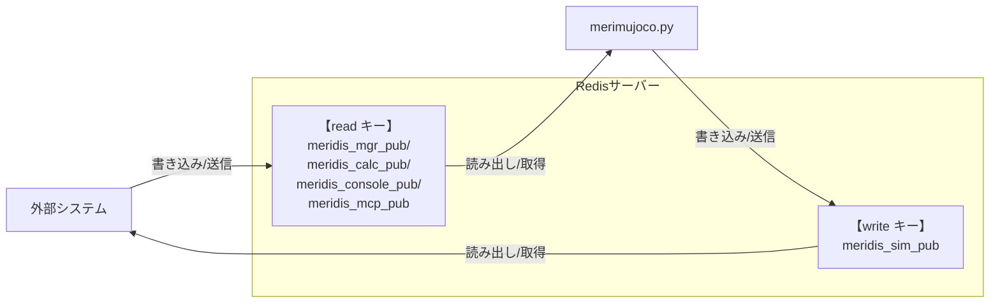

# merimujoco

## 背景・目的

### フィジカルAI・エンボディードAIの潮流

近年、大規模言語モデル（LLM）の進化を背景に、AIが身体性を持ち物理世界で行動する **フィジカルAI**・**エンボディードAI** が急速に注目を集めています。ロボットが実環境で自律的に動作するためには、物理法則に基づいた高精度なシミュレーション環境が不可欠であり、**シミュレーション技術** がこの分野の研究開発の鍵を握っています。


## 概要

本リポジトリの**merimujoco**は、物理シミュレーションエンジン`MuJoCo`を使用したロボットシミュレーションシステムです。

merimujocoは外部システムとのデータ送受信において、柔軟なデータ構造かつ高速なインメモリデータベース`Redis`を使用する**meridis**モジュールとの連動で、**外部システム**との円滑な連携の実現を特長としています。


## 主な機能

- **MuJoCo物理シミュレーション**
  高精度な物理演算を備えた3Dロボットシミュレーション環境を提供する

- **リアルタイム制御**  
  専用スレッドによる最大100Hzの高頻度でデータ処理する

- **Redis経由のデータ処理（meridisモジュール）**
  インメモリデータベースRedis経由でロボット制御データ・状態データを送受信する

  - **Sim2Real**<br>
  リアルロボットの制御システムと連携することで、シミュレーションロボットとリアルロボットの関節の動きを同期・遠隔制御する

  - **Real2Sim**<br>
  リアルロボットの制御システムと連携することで、リアルロボットの関節の動きをシミュレーションロボットで再現する

  - **動作生成プログラム**<br>
  論文研究をベースとした動作生成プログラムの演算結果を入力として、シミュレーション上で再生し動作検証する

  - **MCPサーバー（予約）**<br>
  MCPサーバーと連携することで、AIエージェントからの指令をトリガとして、シミュレーションロボットの制御データ・状態データを送受信できる

- **リセット機能**  
  与えるデータ先頭 data[0]=5556 とするとき、Mujocoのシミュレーション環境をリセットし初期条件に戻すことができる

- **マルチプラットフォーム**
  本プログラムは、Linux/WSL/Windows11/MacOS で動作確認済です。

### MuJoCo の選定理由

数あるロボットシミュレータの中で **MuJoCo（Multi-Joint dynamics with Contact）** が広く選ばれています

- **高速・高精度な接触演算**: 多関節ロボットの接触力学を正確かつ高速に計算でき、歩行・把持など複雑なタスクに対応
- **研究コミュニティとの親和性**: DeepMind による OSS 化以降、強化学習・運動制御の研究論文で事実上の標準シミュレータとして採用が急増
- **軽量・高い拡張性**: CPU のみで動作する軽量設計でノートPCでも手軽に実行可能。さらに **NVIDIA Warp** などGPU並列化技術を活用することで数百倍の高速化を実現でき、大規模強化学習や並列シミュレーションにも対応
- **最新ロボティクスAIとの統合**: **NVIDIA Isaac Sim/Lab**、**Genesis** などの次世代ロボティクスプラットフォームが MuJoCo をコアエンジンとして採用しており、強化学習ライブラリとシームレスに連携可能。論文で発表された最新アルゴリズムを即座に実装・検証できる
- **優れたビルトインUI**: インタラクティブなビューワーが標準搭載され、マウスでの直感的なカメラ操作、スライダーによる関節角度調整、物理パラメータのリアルタイム表示など、デバッグと開発効率を大幅に向上させる機能が提供されている


## セットアップ

merimujoco は **Redis経由でデータ処理** を前提に設計されているため、最初に **meridisモジュール** のセットアップが必要です。

### ステップ1: meridisモジュールのセットアップ ⭐ **必須**

merimujoco の **Redis経由のデータ処理** を利用するために、事前に**meridisモジュール**をセットアップしてください：

[meridis マニュアル](https://github.com/holypong/meridis/blob/main/README.md)

**必要な作業:**
- ✅ Redis サーバーのインストールと起動確認
- ✅ meridisリポジトリのダウンロード
- ✅ 必要なPython依存パッケージのインストール
- ✅ Redisキー初期化
- ✅ ネットワーク設定の確認
---

### ステップ2: Merimujoco のインストール

meridis のセットアップが完了したら、merimujoco をインストールします。

#### 必要なパッケージのインストール

```bash
pip install mujoco numpy redis
```


---

## クイックスタート 🚀

セットアップ完了後、以下の手順で基本的な動作確認を行いましょう。

### 🎯 Step 1: 基本動作確認（シミュレーションのみ）

まず merimujoco 単体での動作を確認します：

```bash
# デフォルト設定で起動テスト
python merimujoco.py
```


**✅ 成功確認:**
- MuJoCoビューワーウィンドウが開いている
- シミュレーションロボットが表示されている  
- マウスのドラッグ操作ででカメラ操作ができる
  - L-Button: 左右上下回転
  - R-Button: 左右上下移動
  - M-Button: 前後移動
- 左メニュー `Option`->`Font` 100% でメニューサイズを調整する
- →メニュー `Control`で任意の関節をL-Buttonドラッグ操作する

**⚠️ 重要：merimujoco 終了方法**  
**ウィンドウ右上の「×」ボタン、または左メニュー `File`->`Quit`で終了してください。**


### 🔗 Step 2: 動作生成プログラムとの連携

次にRedis経由でのデータ送受信を確認します：
`calc_dance_motion.py`というダンスの動作生成プログラムを用意しました。
このプログラムを改造すれば、歩行モーションなど数値計算結果をシミュレーション上で検証できます。

```bash
# ターミナル1: シミュレーション起動
python merimujoco.py --redis redis-calc.json
```

```bash
# ターミナル2: 別ターミナルでダンスモーションを作成する
python calc_dance_motion.py
```


**✅ 成功確認:**
- シミュレーションロボットがダンスを再生する

**⚠️ 重要：merimujoco 終了方法**  
**ウィンドウ右上の「×」ボタン、または左メニュー `File`->`Quit`で終了してください。**

**⚠️ 重要：merimujoco以外の 終了方法**  
**起動したターミナル内で、CTRL+Cで終了してください**


### 🤖 Step 3: シミュレーションからリアルロボットを制御（１）

リアルロボットがある場合：シミュレーションロボットのダンスの動きをリアルロボットに同期させる。
シミュレータとリアルのデジタルツインを体験してください。

**⚠️ 重要：meridisn_manager.py を実行するときは [meridis マニュアル](https://github.com/holypong/meridis/blob/main/README.md)をよく読んでください**
- meridis の インストールディレクトリ下でうごかしてください
- `network.json`のネットワーク設定を確認してください
- `mgr_sim2real.json`のネットワーク設定を確認してください

```bash
# ターミナル1: シミュレーション起動
python merimujoco.py --redis redis-calc.json
```

```bash
# ターミナル2: モーション生成
python meridis_motion_calc.py
```

```bash
# ターミナル3: ブリッジ(Sim2Real)
python meridis_manager.py --mgr mgr_sim2real.json
```

**✅ 成功確認:**
- シミュレーションロボットがダンスを再生する
- 同じ動きがリアルロボットでも再現される

**⚠️ 重要：merimujoco 終了方法**  
**ウィンドウ右上の「×」ボタン、または左メニュー `File`->`Quit`で終了してください。**

**⚠️ 重要：merimujoco以外の 終了方法**  
**起動したターミナル内で、CTRL+Cで終了してください**


### 🤖 Step 4: シミュレーションからリアルロボットを制御（２）

リアルロボットがある場合：シミュレーションロボットの関節操作をリアルロボットに同期させる。
要するに「MuJoCoの標準UIからリアルロボットを遠隔操作する」体験ができます。

```bash
# ターミナル1: シミュレーション起動
python merimujoco.py --redis redis-mgr-direct.json
```

```bash
# ターミナル2: ブリッジ(Sim2Real)
python meridis_manager.py --mgr mgr_sim2real.json
```

**✅ 成功確認:**
- シミュレーションロボットが表示される
- メニュー `Control`で任意の関節をL-Buttonドラッグ操作する
- 同じ動きがリアルロボットでも再現される

**⚠️ 重要：merimujoco 終了方法**  
**ウィンドウ右上の「×」ボタン、または左メニュー `File`->`Quit`で終了してください。**

**⚠️ 重要：merimujoco以外の 終了方法**  
**起動したターミナル内で、CTRL+Cで終了してください**


### 🤖 Step 5: リアルロボットの動きをシミュレーション上で再現

リアルロボットがある場合：リアルロボットの関節の動きをシミュレーションロボットで再現できます。

```bash
# ターミナル1: シミュレーション起動
python merimujoco.py --redis redis-mgr.json
```

```bash
# ターミナル2: ブリッジ(Real2Sim)
python meridis_manager.py --mgr mgr_real2sim.json
```

**✅ 成功確認:**
- シミュレーションロボットが表示される
- リアルロボットの各関節に触れて動かす
- 同じ動きがシミュレーションロボットでも再現される

**⚠️ 重要：merimujoco 終了方法**  
**ウィンドウ右上の「×」ボタン、または左メニュー `File`->`Quit`で終了してください。**

**⚠️ 重要：merimujoco以外の 終了方法**  
**起動したターミナル内で、CTRL+Cで終了してください**


---
## 使い方

### コマンド
```bash
# デフォルト設定で起動する場合
python merimujoco.py
```

**⚠️ 重要：merimujoco 終了方法**  
**ウィンドウ右上の「×」ボタン、または左メニュー `File`->`Quit`で終了してください。**

### コマンドオプション
- `--redis <ファイル名>`: Redis設定JSONファイルを指定（デフォルト: `redis.json`）

#### 設定ファイルの形式

Redis接続設定を JSON ファイルで管理します。
ファイルが存在しない場合は安全なデフォルト値（127.0.0.1:6379）を使用します。

```json
{
  "redis": {
    "host": "127.0.0.1",
    "port": 6379
  },
  "redis_keys": {
    "read": "meridis_mgr_pub",
    "write": "meridis_sim_pub"
  },
  "data_flow": {
    "redis_to_joint": false,
    "joint_to_redis": true
  }
}
```
##### 設定項目

- **redis**: Redisサーバーの接続情報
  - `host`: Redisサーバーのホスト名またはIPアドレス
  - `port`: Redisサーバーのポート番号
- **redis_keys**: データ交換用のRedisキー
  - `read`: 制御システムからの指令データを読み取るキー
  - `write`: シミュレーション状態データを書き込むキー
- **data_flow**: データフローの制御 **[試験中]**
  - `redis_to_joint`: Redisから受信した値をMuJoCoの関節にセット (デフォルト: `true`)
  - `joint_to_redis`: MuJoCoの関節角度をRedisに送信 (デフォルト: `false`)

##### 各設定ファイルの違い

本リポジトリには、用途別に6個のJSON設定ファイルが用意されています。すべてのファイルで redis 接続設定（host: 127.0.0.1, port: 6379）は共通ですが、`redis_keys`と`data_flow`が異なります。

| ファイル名 | read キー | write キー | redis_to_joint | joint_to_redis | 用途 |
|-----------|----------|-----------|----------------|----------------|------|
| [redis.json](redis.json) | `meridis_mgr_pub` | `meridis_sim_pub` | ❌ false | ✅ true | デフォルト設定 |
| [redis-mgr-direct.json](redis-mgr-direct.json) | `meridis_mgr_pub` | `meridis_sim_pub` | ❌ false | ✅ true | Mujoco UI操作 |
| [redis-mgr.json](redis-mgr.json) | `meridis_mgr_pub` | `meridis_sim_pub` | ✅ true | ❌ false | Sim2Real/Real2Sim（リアル←→シミュレーション） |
| [redis-calc.json](redis-calc.json) | `meridis_calc_pub` | `meridis_sim_pub` | ✅ true | ✅ true | 動作生成プログラムとの連携（双方向） |
| [redis-console.json](redis-console.json) | `meridis_console_pub` | `meridis_sim_pub` | ✅ true | ❌ false | コンソール入力からの制御【予約】 |
| [redis-mcp.json](redis-mcp.json) | `meridis_mcp_pub` | `meridis_sim_pub` | ✅ true | ❌ false | MCPサーバーとの連携【予約】 |

---
## 技術詳細

### データフロー図



#### 関節マッピング
##### joint_names[] と XMLファイルのjoint名
- **概要**: `merimujoco.py` の `joint_names` リストは、MuJoCoモデルのactuator順序に基づいてインデックス付けされた関節名を定義しています。
- **注意点**: 読み込む `roid1_mjcf.xml` のjoint名と `joint_names[]` が一致しない場合でも、MuJoCo の `data.ctrl` はモデルのactuator順序に基づいてインデックス付けされることから、`joint_names` リストの順序がXMLファイルのactuator順序と一致していれば、問題なく扱えます。
- **推奨**: 可読性のためには、`joint_names[]` リストの関節名をXMLファイルのjoint名と一致させることを推奨します。

```python
joint_names = [
    "c_chest", "c_head", "l_shoulder_pitch", "l_shoulder_roll", "l_elbow_yaw", "l_elbow_pitch",
    "r_shoulder_pitch", "r_shoulder_roll", "r_elbow_yaw", "r_elbow_pitch",
    "l_hip_yaw", "l_hip_roll", "l_thigh_pitch", "l_knee_pitch", "l_ankle_pitch", "l_ankle_roll",
    "r_hip_yaw", "r_hip_roll", "r_thigh_pitch", "r_knee_pitch", "r_ankle_pitch", "r_ankle_roll"
]
```
### ファイルの種類


##### joint_to_meridis[] と meridis_sim_pub テーブル
- **概要**: `joint_to_meridis` 辞書は、各関節名をMeridisデータ配列のインデックスと乗数にマッピングします。
これにより、Redisから受信した関節角度データを適切に変換してMuJoCoの`data.ctrl`に適用できます。
- **構造**: 各エントリは `[インデックス, 乗数]` の形式です
  - インデックスはMeridis配列の位置
  - 乗数は符号反転などの調整
- **用途**: Redis経由のデータ交換で、外部制御システムの指令値をシミュレーション内の関節制御に変換します。

```python
joint_to_meridis = {
    # Base link
    "base_roll":        [12, 1],
    "base_pitch":       [13, 1],
    "base_yaw":         [14, 1],
    # Head
    "c_head":           [21, 1],
    # Left arm
    "l_shoulder_pitch": [23, 1],
    "l_shoulder_roll":  [25, 1],
    "l_elbow_yaw":      [27, 1],
    "l_elbow_pitch":    [29, 1],
    # Left leg
    "l_hip_yaw":        [31, 1],
    "l_hip_roll":       [33, 1],
    "l_thigh_pitch":    [35, 1],
    "l_knee_pitch":     [37, 1],
    "l_ankle_pitch":    [39, 1],
    "l_ankle_roll":     [41, 1],
    # chest
    "c_chest":          [51, 1],
    # Right arm
    "r_shoulder_pitch": [53, 1],
    "r_shoulder_roll":  [55,-1],
    "r_elbow_yaw":      [57,-1],
    "r_elbow_pitch":    [59, 1],
    # Right leg
    "r_hip_yaw":        [61,-1],
    "r_hip_roll":       [63,-1],
    "r_thigh_pitch":    [65, 1],
    "r_knee_pitch":     [67, 1],
    "r_ankle_pitch":    [69, 1],
    "r_ankle_roll":     [71,-1]
}
```
### 特殊機能

#### リセット機能
- **条件**: Redis経由で `data[0] == 5556` を受信
- **動作**: MuJoCoシミュレーション状態を初期化（mj_resetData）
- **用途**: 制御実験の初期化、異常状態からの復旧


