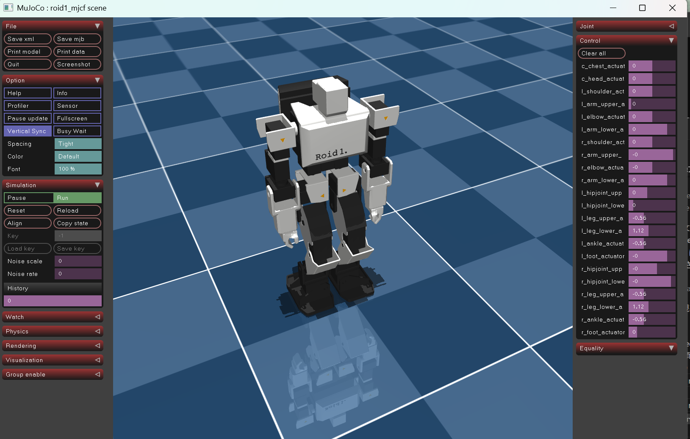
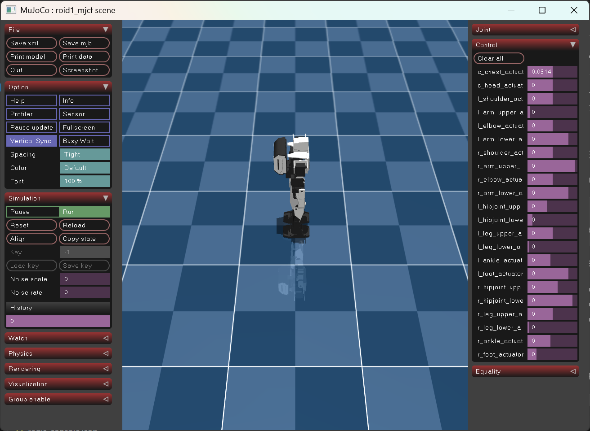
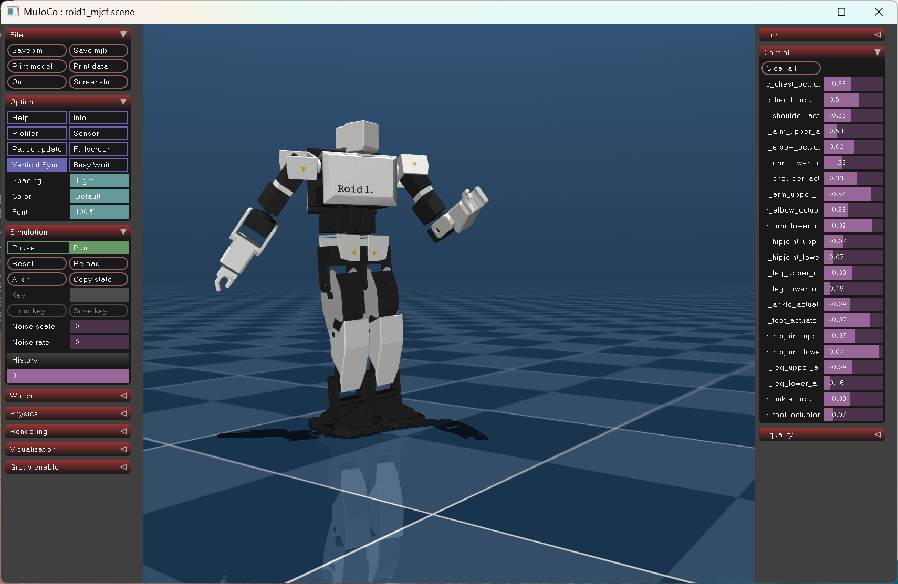
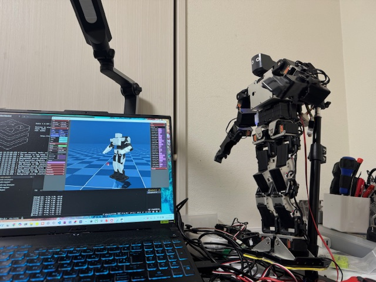
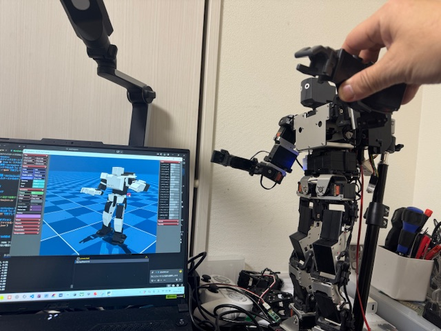

# merimujoco

**merimujoco**は、物理シミュレーションMuJoCoとロボット実機のSimToReal、RealToSimを容易に実現するためのツールです。  
シミュレーション上で実行したロボットの動きのデータを、リアルタイムでロボット実機に送って動作させることができます。逆にロボット実機の動作データをシミュレータに送ることもできます。  
<BR>

---

# 概要

本リポジトリの**merimujoco**は、物理シミュレーションエンジン`MuJoCo`を使用したロボットシミュレーションシステムです。

高速なインメモリデータベース **Redis** の read/write キーを共通I/Fとして扱うことで、外部システムを差し替え可能にするための**meridis**モジュールを提供します。

拡張機能として、AIエージェントが生成した制御指令をMCP経由でシミュレーションまたはロボット実機に渡すシステムの公開も予定しています。



- **MuJoCo**  
Google DeepMind社が提供するオープンソースの高精度な物理シミュレーション環境です。

 - **Redis**  
オープンソースの高速なインメモリデータストアです。
 
- **meridis**  
Redisを用いたロボットの制御データ・状態データの送受信モジュール。  
専用スレッドにより最大100Hzのデータ処理が可能です。

-  **merimujoco**（要確認★★★★）  
動作生成アルゴリズムをPythonで記述することが可能なプログラム。  
論文研究をベースとした動作生成プログラムをシミュレーション上で再生し動作検証することができ、シミュレーターのリセット等も可能です。

- **Meridian** (オプション)  
merimujocoからロボット実機を動かす際に必要となるオープンソースのシステム。
専用ボードと専用ソフトで構成されます。**シミュレーターのみを使う場合はMeridianの準備は不要です**。。
<BR>  

---
# 対応機種

- Linux/WSL/Windows11/MacOS で動作確認済
<BR>  

---
# インストール

merimujoco は Redis経由でデータ処理を行うため、最初に**Redis**および **meridisモジュール** のセットアップを行います。  
<BR>  

## STEP 1:  Redis および meridisモジュール のセットアップ


[meridis マニュアル](https://github.com/holypong/meridis/blob/main/README.md)

**必要な作業:**

- ✅ Redis サーバーのインストールと起動確認
- ✅ meridisリポジトリのダウンロード
- ✅ 必要なPython依存パッケージのインストール
- ✅ Redisキー初期化
- ✅ ネットワーク設定の確認
<BR>  

##  STEP 2: MuJoCo および merimujoco のインストール

meridis のセットアップが完了したら、MuJoCoおよびmerimujoco をインストールします。

### 必要なパッケージのインストール

Python 3.11以上（要確認★★★★）の仮想環境を作成し、下記のパッケージをインストールします。

```bash
pip install mujoco numpy redis
```
  
以上でインストールは完了です。  
<BR>  
---
# 動作確認

本システムの核心は、インメモリデータベース Redisの read/write キーを共通I/F扱いにすることで、 Sim/Real/AI をほぼ同様の手順でシームレスにつなぐことにあります。

善術のセットアップ完了後、以下の順に基本的な動作確認を行なってください。  

- Quick Start 1,2 : PCのみで動作可能なテストです。  
- Quick Start 3,4,5 : Meridian搭載のロボット実機を用いた動作テストです。  
  
<BR>  
  
---
## Quick Start 1 : 基本動作確認

まず merimujoco 単体での動作を確認します。

```bash
# デフォルト設定で起動テスト
python merimujoco.py
```

**✅ 成功確認:**


- MuJoCoビューワーウィンドウが開いている
- シミュレーションロボットが表示されている
- マウスのドラッグ操作でカメラ操作ができる
- L-Button: 左右上下回転
- R-Button: 左右上下移動
- M-Button: 前後移動
- 左メニュー `Option`->`Font` 100% でメニューサイズを調整する
- →メニュー `Control`で任意の関節をL-Buttonドラッグ操作する

**⚠️ 重要：merimujoco 終了方法**

**ウィンドウ右上の「×」ボタン、または左メニュー `File`->`Quit`で終了してください。**  
<BR>  
  
---  
## Quick Start 2 : 動作生成プログラムとの連携

このステップでは、merimujoco と外部システムが、関節角度の指令（read）と状態（write）を共通I/F扱いで接続できることを確認します。

- `calc_dance_motion.py`というダンスの動作生成プログラムを用意しました。
- このプログラムを改造すれば、歩行モーションなど数値計算結果をシミュレーション上で検証できます。

```bash
# ターミナル1: シミュレーション起動
python merimujoco.py --redis redis-calc.json
```

```bash
# ターミナル2: 別ターミナルでダンスモーションを作成する
python calc_dance_motion.py
```

**✅ 成功確認:**



- シミュレーションロボットがダンスを再生する

**⚠️ 重要：merimujoco 終了方法**

**ウィンドウ右上の「×」ボタン、または左メニュー `File`->`Quit`で終了してください。**

**⚠️ 重要：merimujoco以外の 終了方法**

**起動したターミナル内で、CTRL+Cで終了してください**　　
<BR>　　
Meridianを搭載したロボットが手元にない場合は、ここで動作確認は完了です。  

<BR>  
  
---  
## Quick Start 3 : シミュレーターとロボット実機の同期

Meridianを搭載したロボット実機がある場合、シミュレーションロボットのダンスの動きをロボット実機に同期させることができます。  
(Meridianへのリンクは必要★★★★)  

シミュレータとリアルのデジタルツインを体験してください。

**⚠️ 重要：meridis_manager.py を実行するときは [meridis マニュアル](https://github.com/holypong/meridis/blob/main/README.md)をよく読んでください**

- meridis の インストールディレクトリ下で動かしてください
- network.json`のネットワーク設定を確認してください
- mgr_sim2real.json`のネットワーク設定を確認してください

```bash
# ターミナル1: シミュレーション起動
python merimujoco.py --redis redis-calc.json
```

```bash
# ターミナル2: モーション生成
python meridis_motion_calc.py
```

```bash
# ターミナル3: ブリッジ(Sim2Real)
python meridis_manager.py --mgr mgr_sim2real.json
```

**✅ 成功確認:**


- シミュレーションロボットがダンスを再生する

- 同じ動きがロボット実機でも再現される

**⚠️ 重要：merimujoco 終了方法**

**ウィンドウ右上の「×」ボタン、または左メニュー `File`->`Quit`で終了してください。**

**⚠️ 重要：merimujoco以外の 終了方法**

**起動したターミナル内で、CTRL+Cで終了してください**  

<BR>  
  
------  
## Quick Start 4 : シミュレーションからロボット実機を操作

Meridianを搭載したロボット実機がある場合、シミュレーションロボットの関節操作をロボット実機に同期させことができます。

ここでは、MuJoCoの標準UIからロボット実機を遠隔操作できることを確認します。

```bash
# ターミナル1: シミュレーション起動
python merimujoco.py --redis redis-mgr-direct.json
```

```bash
# ターミナル2: ブリッジ(Sim2Real)
python meridis_manager.py --mgr mgr_sim2real.json
```

**✅ 成功確認:**


- シミュレーションロボットが表示される
- メニュー `Control`で任意の関節をL-Buttonドラッグ操作する
- 同じ動きがロボット実機でも再現される

**⚠️ 重要：merimujoco 終了方法**
**ウィンドウ右上の「×」ボタン、または左メニュー `File`->`Quit`で終了してください。**

**⚠️ 重要：merimujoco以外の 終了方法**
**起動したターミナル内で、CTRL+Cで終了してください**
<BR>  
  
---
## Quick Start 5 : ロボット実機の動きをシミュレーション上で再現

Meridianを搭載したロボット実機がある場合、ロボット実機の関節の動きをシミュレーション上のロボットで再現できます。

```bash
# ターミナル1: シミュレーション起動
python merimujoco.py --redis redis-mgr.json
```

```bash
# ターミナル2: ブリッジ(Real2Sim)
python meridis_manager.py --mgr mgr_real2sim.json
```

**✅ 成功確認:**



- シミュレーションロボットが表示される
- ロボット実機の各関節を手で動かす
- 同じ動きがシミュレーションロボットでも再現される

**⚠️ 重要：merimujoco 終了方法**
**ウィンドウ右上の「×」ボタン、または左メニュー `File`->`Quit`で終了してください。**

**⚠️ 重要：merimujoco以外の 終了方法**
**起動したターミナル内で、CTRL+Cで終了してください**
<BR>  
おつかれさまでした！ これで基本的な動作確認はすべて完了です。  
以下、研究開発を進めるための仕様などの参考資料に続きます。  

[背景・目的](README_concept.md)
[仕様](README_advance.md)