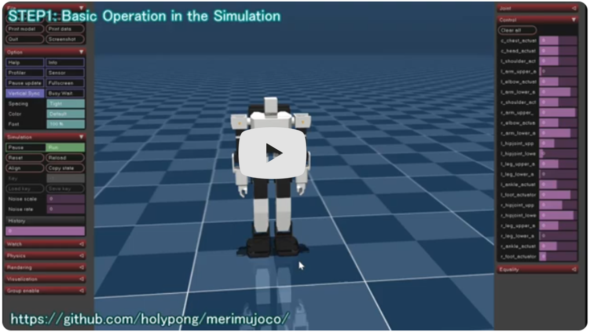
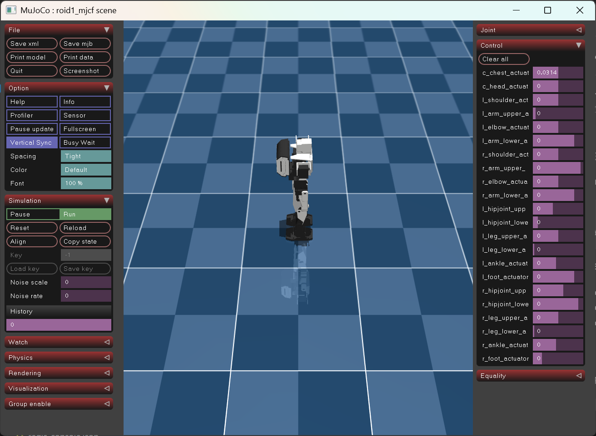
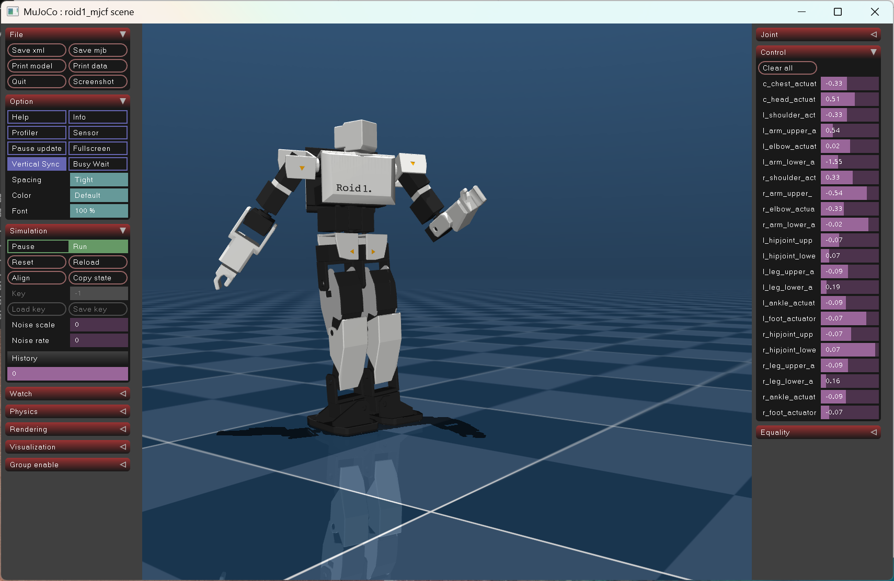
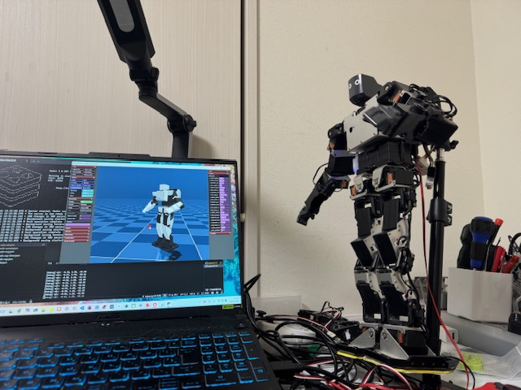
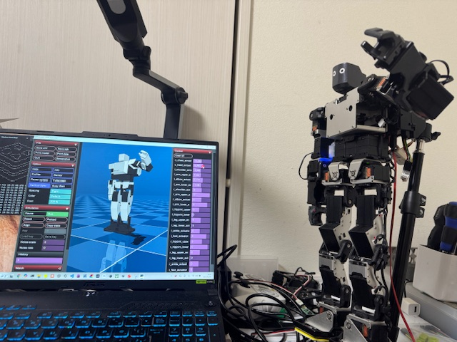
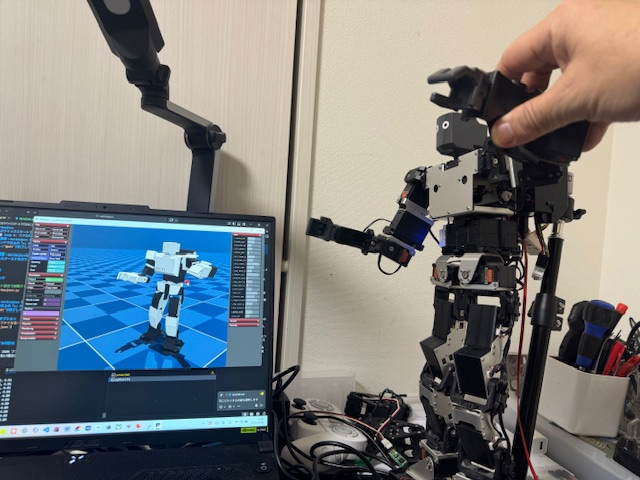

# merimujoco

English / [Japanese](README.md)

**merimujoco** is a tool designed to simplify SimToReal and RealToSim workflows between the MuJoCo physics simulation and a physical robot.  
It allows you to stream joint motion data from simulation to a real robot in real time, and conversely to send real robot motion data back into the simulator.

---

## Overview

**merimujoco** in this repository is a robot simulation system built on the physics engine `MuJoCo`.

It provides the **meridis** module, which uses read/write keys of the high-speed in-memory database **Redis** as a common interface, making external systems interchangeable.

As a planned extension, a system that passes control commands generated by an AI agent to the simulation or physical robot via an MCP server is also under development.

[](https://www.youtube.com/watch?v=PYukdFwX8sE)
<br>Click the image above to play the YouTube video.

- **MuJoCo**  
  An open-source high-fidelity physics simulation environment provided by Google DeepMind.

- **Redis**  
  An open-source, high-speed in-memory data store.

- **meridis**  
  A module provided by holypong for sending and receiving robot control and state data via Redis.  
  A dedicated thread enables data processing at up to 100 Hz.

- **merimujoco**  
  A program provided by holypong that allows motion generation algorithms to be written in Python.  
  Motion generation programs based on academic research can be verified in simulation through repeated playback and reset cycles. Developed by holypong.

- **Meridian** (optional)  
  An open-source system provided by ninagawa123, required for moving a physical robot from merimujoco.  
  It consists of a dedicated board and dedicated software. **Meridian is not required if you only use the simulator.**<br>
  [What is the Meridian project?](https://note.com/ninagawa123/n/ncfde7a6fc835)
<BR>

---
## Supported Platforms

- Verified on Linux / WSL / Windows 11 / macOS
<BR>

## Robot Model

- **Roid1** provided by Ninagawa123<br>
  https://github.com/Ninagawa123/URDF_kitchen

---
## Installation

merimujoco processes data via Redis, so you must first set up **Redis** and the **meridis module**.
<BR>

### STEP 1: Set up Redis and the meridis module

[meridis manual](https://github.com/holypong/meridis/blob/main/README_EN.md)

**Required tasks:**

- ✅ Install and verify the Redis server
- ✅ Download the meridis repository
- ✅ Install required Python dependencies
- ✅ Initialize Redis keys
- ✅ Verify network settings
<BR>

### STEP 2: Install MuJoCo and merimujoco

Once the meridis setup is complete, install MuJoCo and merimujoco.

#### Install required packages

Create a Python 3.11+ virtual environment and install the following packages:

```bash
pip install mujoco numpy redis opencv-python matplotlib
```

If you encounter a `glfw` import error, install it additionally as needed:

```bash
pip install glfw
```

Installation is now complete.

---

## Quick Start

The core of this system lies in using the Redis read/write keys as a common interface, enabling Sim / Real / AI to be connected seamlessly in nearly the same way.

After completing the setup above, perform the basic verification steps in the order below.  
**(Keep the terminal running Redis-Server open at all times.)**

- Quick Start 1, 2: Tests that run on a PC only.  
- Quick Start 3, 4, 5: Operation tests using a physical robot equipped with Meridian.

<BR>

---
### Quick Start 1: Basic Operation Check

First, verify that merimujoco works on its own.

**Quick Start 1 uses 1 terminal.**<br>
**(The Redis-Server terminal must remain open separately.)**

Work in the directory where `merimujoco` is installed:
```bash
# Launch with default settings
python merimujoco.py
```

**✅ Success criteria:**



- The MuJoCo viewer window opens
- The simulation robot is displayed
- Camera can be controlled by mouse drag:
  - L-Button: Rotate (horizontal/vertical)
  - R-Button: Pan (horizontal/vertical)
  - M-Button: Zoom in/out
- Adjust menu size via left menu `Option` -> `Font` 100%
- Drag any joint with L-Button via right menu `Control`

**⚠️ Important: How to quit merimujoco**

**Use the "×" button in the top-right of the window, or left menu `File` -> `Quit`.**
<BR>

---
### Quick Start 2: Integration with a Motion Generation Program

In this step, you verify that merimujoco and an external system can connect seamlessly using joint angle commands (read) and state (write) via the common interface.

- A dance motion generation program called `calc_dance_motion.py` is provided.
- By modifying this program, you can verify numerical calculation results (e.g., walking motion) in simulation.

**Quick Start 2 uses 2 terminals.**<br>
**(The Redis-Server terminal must remain open separately.)**

Work in the directory where `merimujoco` is installed:
```bash
# Terminal 1: Launch simulation
python merimujoco.py --redis redis-calc.json
```

```bash
# Terminal 2: Run dance motion in a separate terminal
python calc_dance_motion.py
```

**✅ Success criteria:**



- The simulation robot plays the dance

**⚠️ Important: How to quit merimujoco**

**Use the "×" button in the top-right of the window, or left menu `File` -> `Quit`.**

**⚠️ Important: How to quit calc_dance_motion.py**

**Press CTRL+C in the terminal where it was launched.**

If you do not have a Meridian-equipped robot, the operation check is complete here.

---
### Quick Start 3: Synchronizing Simulator and Physical Robot

If you have a physical robot equipped with Meridian, you can synchronize the dance movements of the simulation robot to the real robot.  
[What is the Meridian project?](https://note.com/ninagawa123/n/ncfde7a6fc835)

The robot used is the **KHR-3HV ver2. (22-axis version)** by Kondo Kagaku Co., Ltd.<br>
https://kondo-robot.com/product/03206

Experience the digital twin of simulator and real robot.

**⚠️ Important: Read the [meridis manual](https://github.com/holypong/meridis/blob/main/README_EN.md) carefully before running meridis_manager.py**

- Run `meridis_manager.py` from within the meridis installation directory
- Verify the network settings in `network.json` beforehand
- Verify the network settings in `mgr_sim2real.json` beforehand

**Quick Start 3 uses 3 terminals.**<br>
**(The Redis-Server terminal must remain open separately.)**

Work in the directory where `merimujoco` is installed:
```bash
# Terminal 1: Launch simulation
python merimujoco.py --redis redis-calc.json
```

```bash
# Terminal 2: Run dance motion in a separate terminal
python calc_dance_motion.py
```
At this point, the robot in MuJoCo will dance just as in Quick Start 2.

Work in the directory where `meridis` is installed:
```bash
# Terminal 3: Launch the bridge in Sim2Real mode
python meridis_manager.py --mgr mgr_sim2real.json
```

**✅ Success criteria:**



- The simulation robot plays the dance
- The same movements are reproduced on the physical robot

**⚠️ Important: How to quit merimujoco**

**Use the "×" button in the top-right of the window, or left menu `File` -> `Quit`.**

**⚠️ Important: How to quit calc_dance_motion.py**

**Press CTRL+C in the terminal where it was launched.**<br>
**You may close that terminal as calc_dance_motion.py is not needed going forward.**

**⚠️ Important: How to quit meridis_manager.py**

**Press CTRL+C in the terminal where it was launched.**

<BR>

------
### Quick Start 4: Controlling the Physical Robot from Simulation

If you have a physical robot equipped with Meridian, you can synchronize joint operations of the simulation robot to the physical robot.

Here, you verify that the physical robot can be remotely controlled from the MuJoCo standard UI.

**Quick Start 4 uses 2 terminals.**<br>
**(The Redis-Server terminal must remain open separately.)**

Work in the directory where `merimujoco` is installed:
```bash
# Terminal 1: Launch simulation
python merimujoco.py --redis redis-mgr-direct.json
```

Work in the directory where `meridis` is installed:
```bash
# Terminal 2: Launch the bridge in Sim2Real mode
python meridis_manager.py --mgr mgr_sim2real.json
```

**✅ Success criteria:**



- The simulation robot is displayed
- Drag any joint with L-Button via the `Control` menu
- The same movements are reproduced on the physical robot

**⚠️ Important: How to quit merimujoco**

**Use the "×" button in the top-right of the window, or left menu `File` -> `Quit`.**

**⚠️ Important: How to quit meridis_manager.py**

**Press CTRL+C in the terminal where it was launched.**
<BR>

---
### Quick Start 5: Reproducing Physical Robot Motion in Simulation

If you have a physical robot equipped with Meridian, you can reproduce the joint movements of the physical robot on the simulation robot.

**Quick Start 5 uses 2 terminals.**<br>
**(The Redis-Server terminal must remain open separately.)**

Work in the directory where `merimujoco` is installed:
```bash
# Terminal 1: Launch simulation
python merimujoco.py --redis redis-mgr.json
```

Work in the directory where `meridis` is installed:
```bash
# Terminal 2: Launch the bridge in Real2Sim mode
python meridis_manager.py --mgr mgr_real2sim.json
```

**✅ Success criteria:**



- The simulation robot is displayed
- Manually move each joint of the physical robot
- The same movements are reproduced on the simulation robot

**⚠️ Important: How to quit merimujoco**

**Use the "×" button in the top-right of the window, or left menu `File` -> `Quit`.**

**⚠️ Important: How to quit meridis_manager.py**

**Press CTRL+C in the terminal where it was launched.**
<BR>

Congratulations! All basic operation checks are now complete.

## 📚 For Further Reading
Reference materials for advancing research and engineering work:

- **[Read the background, goals, and glossary](https://github.com/holypong/meridis/blob/main/README_concept_EN.md)** - Why merimujoco? Why meridis? What world does it open up?
- **[Read the technical specification](README_advance_EN.md)** - Command details, config file structure, and customization

## License

This project is licensed under the MIT License - see the LICENSE file for details.
