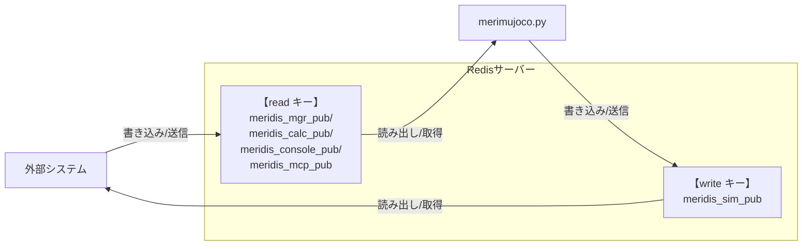

---
## 使い方

### コマンド
```bash
# デフォルト設定で起動する場合
python merimujoco.py
```

**⚠️ 重要：merimujoco 終了方法**  
**ウィンドウ右上の「×」ボタン、または左メニュー `File`->`Quit`で終了してください。**

### コマンドオプション
- `--redis <ファイル名>`: Redis設定JSONファイルを指定（デフォルト: `redis.json`）


---
#### 設定ファイルの形式

Redis接続設定を JSON ファイルで管理します。
ファイルが存在しない場合は安全なデフォルト値（127.0.0.1:6379）を使用します。

```json
{
  "redis": {
    "host": "127.0.0.1",
    "port": 6379
  },
  "redis_keys": {
    "read": "meridis_mgr_pub",
    "write": "meridis_sim_pub"
  },
  "data_flow": {
    "redis_to_joint": false,
    "joint_to_redis": true
  }
}
```
##### 設定項目

- **redis**: Redisサーバーの接続情報
  - `host`: Redisサーバーのホスト名またはIPアドレス
  - `port`: Redisサーバーのポート番号
- **redis_keys**: データ交換用のRedisキー
  - `read`: 制御システムからの指令データを読み取るキー
  - `write`: シミュレーション状態データを書き込むキー
- **data_flow**: データフローの制御 **[試験中]**
  - `redis_to_joint`: Redisから受信した値をMuJoCoの関節にセット (デフォルト: `true`)
  - `joint_to_redis`: MuJoCoの関節角度をRedisに送信 (デフォルト: `false`)

##### 各設定ファイルの違い

本リポジトリには、用途別に6個のJSON設定ファイルが用意されています。すべてのファイルで redis 接続設定（host: 127.0.0.1, port: 6379）は共通ですが、`redis_keys`と`data_flow`が異なります。

| ファイル名 | read キー | write キー | redis_to_joint | joint_to_redis | 用途 |
|-----------|----------|-----------|----------------|----------------|------|
| [redis.json](redis.json) | `meridis_mgr_pub` | `meridis_sim_pub` | ❌ false | ✅ true | デフォルト設定 |
| [redis-mgr-direct.json](redis-mgr-direct.json) | `meridis_mgr_pub` | `meridis_sim_pub` | ❌ false | ✅ true | MuJoCo UI操作 |
| [redis-mgr.json](redis-mgr.json) | `meridis_mgr_pub` | `meridis_sim_pub` | ✅ true | ❌ false | Sim2Real/Real2Sim（リアル←→シミュレーション） |
| [redis-calc.json](redis-calc.json) | `meridis_calc_pub` | `meridis_sim_pub` | ✅ true | ✅ true | 動作生成プログラムとの連携（双方向） |
| [redis-console.json](redis-console.json) | `meridis_console_pub` | `meridis_sim_pub` | ✅ true | ❌ false | コンソール入力からの制御【予告】 |
| [redis-mcp.json](redis-mcp.json) | `meridis_mcp_pub` | `meridis_sim_pub` | ✅ true | ❌ false | MCPサーバーとの連携【予告】 |

---
## 技術詳細

### データフロー図



#### 関節マッピング
##### joint_names[] と XMLファイルのjoint名
- **概要**: `merimujoco.py` の `joint_names` リストは、MuJoCoモデルのactuator順序に基づいてインデックス付けされた関節名を定義しています。
- **注意点**: 読み込む `roid1_mjcf.xml` のjoint名と `joint_names[]` が一致しない場合でも、MuJoCo の `data.ctrl` はモデルのactuator順序に基づいてインデックス付けされることから、`joint_names` リストの順序がXMLファイルのactuator順序と一致していれば、問題なく扱えます。
- **推奨**: 可読性のためには、`joint_names[]` リストの関節名をXMLファイルのjoint名と一致させることを推奨します。

```python
joint_names = [
    "c_chest", "c_head", "l_shoulder_pitch", "l_shoulder_roll", "l_elbow_yaw", "l_elbow_pitch",
    "r_shoulder_pitch", "r_shoulder_roll", "r_elbow_yaw", "r_elbow_pitch",
    "l_hip_yaw", "l_hip_roll", "l_thigh_pitch", "l_knee_pitch", "l_ankle_pitch", "l_ankle_roll",
    "r_hip_yaw", "r_hip_roll", "r_thigh_pitch", "r_knee_pitch", "r_ankle_pitch", "r_ankle_roll"
]
```

##### joint_to_meridis[] と meridis_sim_pub テーブル
- **概要**: `joint_to_meridis` 辞書は、各関節名をMeridisデータ配列のインデックスと乗数にマッピングします。
これにより、Redisから受信した関節角度データを適切に変換してMuJoCoの`data.ctrl`に適用できます。
- **構造**: 各エントリは `[インデックス, 乗数]` の形式です
  - インデックスはMeridis配列の位置
  - 乗数は符号反転などの調整
- **用途**: Redis経由のデータ交換で、外部制御システムの指令値をシミュレーション内の関節制御に変換します。

```python
joint_to_meridis = {
    # Base link
    "base_roll":        [12, 1],
    "base_pitch":       [13, 1],
    "base_yaw":         [14, 1],
    # Head
    "c_head":           [21, 1],
    # Left arm
    "l_shoulder_pitch": [23, 1],
    "l_shoulder_roll":  [25, 1],
    "l_elbow_yaw":      [27, 1],
    "l_elbow_pitch":    [29, 1],
    # Left leg
    "l_hip_yaw":        [31, 1],
    "l_hip_roll":       [33, 1],
    "l_thigh_pitch":    [35, 1],
    "l_knee_pitch":     [37, 1],
    "l_ankle_pitch":    [39, 1],
    "l_ankle_roll":     [41, 1],
    # chest
    "c_chest":          [51, 1],
    # Right arm
    "r_shoulder_pitch": [53, 1],
    "r_shoulder_roll":  [55,-1],
    "r_elbow_yaw":      [57,-1],
    "r_elbow_pitch":    [59, 1],
    # Right leg
    "r_hip_yaw":        [61,-1],
    "r_hip_roll":       [63,-1],
    "r_thigh_pitch":    [65, 1],
    "r_knee_pitch":     [67, 1],
    "r_ankle_pitch":    [69, 1],
    "r_ankle_roll":     [71,-1]
}
```
### 特殊機能

#### リセット機能
- **条件**: Redis経由で `data[0] == 5556` を受信
- **動作**: MuJoCoシミュレーション状態を初期化（mj_resetData）
- **用途**: 制御実験の初期化、異常状態からの復旧

---
