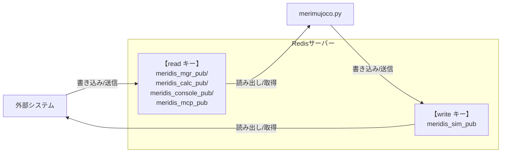

# merimujoco - 技術仕様

**merimujoco**の詳細な技術仕様、設定ファイルの構造、カスタマイズ方法を解説します。  
システムを拡張したい、独自の設定で動かしたい方はこちらをご覧ください。  
<BR>

---

## 仕様

## コマンド
```bash
# デフォルト設定で起動する場合
python merimujoco.py
```

**⚠️ 重要：merimujoco 終了方法**  
**ウィンドウ右上の「×」ボタン、または左メニュー `File`->`Quit`で終了してください。**

### コマンドオプション
- `--redis <ファイル名>`: Redis設定JSONファイルを指定（デフォルト: `redis.json`）
- `--getfoot <BOOL>`: 足先XYZ位置を Meridim90 の `id47-49`（左）・`id77-79`（右）に書き込む（デフォルト: `true`）
- `--gethand <BOOL>`: 手先XYZ位置を Meridim90 の `id44-46`（左）・`id74-76`（右）に書き込む（デフォルト: `false`）
- `--view <MODE>`: カメラビューモードを指定（`fpv`: ヘッド搭載カメラ `head_fpv` の一人称視点）
- `--sphere <X,Y,Z>`: タッチ検出球をワールド座標（メートル）に配置（例: `--sphere 0.2,-0.01,0.35`）。省略時は球を非表示にし、Meridim90[80-83] は 0。
- `--stream [HZ]`: FPVオフスクリーンレンダリングを有効化し、カメラ `head_fpv` の映像と Meridim90 を Redis キー `meridis_frame_pub` へ配信。`HZ` を指定すると 1-100Hz の範囲で送信間隔を調整できます（省略時: 10Hz）。`opencv-python` が必要（`pip install opencv-python`）。


---
### 設定ファイルの形式

Redis接続設定を JSON ファイルで管理します。
ファイルが存在しない場合は安全なデフォルト値（127.0.0.1:6379）を使用します。

```json
{
  "redis": {
    "host": "127.0.0.1",
    "port": 6379
  },
  "redis_keys": {
    "read": "meridis_mgr_pub",
    "write": "meridis_sim_pub"
  },
  "data_flow": {
    "redis_to_joint": false,
    "joint_to_redis": true
  }
}
```
#### 設定項目

- **redis**: Redisサーバーの接続情報
  - `host`: Redisサーバーのホスト名またはIPアドレス
  - `port`: Redisサーバーのポート番号
- **redis_keys**: データ交換用のRedisキー
  - `read`: 制御システムからの指令データを読み取るキー
  - `write`: シミュレーション状態データを書き込むキー
- **data_flow**: データフローの制御 **[試験中]**
  - `redis_to_joint`: Redisから受信した値をMuJoCoの関節にセット (コードデフォルト: `true`、`redis.json` では `false`)
  - `joint_to_redis`: MuJoCoの関節角度をRedisに送信 (コードデフォルト: `false`、`redis.json` では `true`)

#### 各設定ファイルの違い

本リポジトリには、用途別に6個のJSON設定ファイルが用意されています。すべてのファイルで redis 接続設定（host: 127.0.0.1, port: 6379）は共通ですが、`redis_keys`と`data_flow`が異なります。

| ファイル名 | read キー | write キー | redis_to_joint | joint_to_redis | 用途 |
|-----------|----------|-----------|----------------|----------------|------|
| [redis.json](redis.json) | `meridis_mgr_pub` | `meridis_sim_pub` | ❌ false | ✅ true | デフォルト設定 |
| [redis-mgr-direct.json](redis-mgr-direct.json) | `meridis_mgr_pub` | `meridis_sim_pub` | ❌ false | ✅ true | MuJoCo UI操作 |
| [redis-mgr.json](redis-mgr.json) | `meridis_mgr_pub` | `meridis_sim_pub` | ✅ true | ❌ false | Sim2Real/Real2Sim（リアル←→シミュレーション） |
| [redis-calc.json](redis-calc.json) | `meridis_calc_pub` | `meridis_sim_pub` | ✅ true | ✅ true | 動作生成プログラムとの連携（双方向） |
| [redis-console.json](redis-console.json) | `meridis_console_pub` | `meridis_sim_pub` | ✅ true | ❌ false | コンソール入力からの制御【予告】 |
| [redis-mcp.json](redis-mcp.json) | `meridis_mcp_pub` | `meridis_sim_pub` | ✅ true | ❌ false | MCPサーバーとの連携【予告】 |

---
## 技術詳細

### データフロー図


```mermaid
flowchart LR
  Controller[外部システム]
  Simulation[merimujoco.py]
  subgraph Redisサーバー
    ReadKey["【read キー】<br/>meridis_mgr_pub/<br>meridis_calc_pub/<br>meridis_console_pub/<br> meridis_mcp_pub"]
    WriteKey["【write キー】<br/>meridis_sim_pub"]
  end
  Controller -- 書き込み/送信 --> ReadKey
  ReadKey -- 読み出し/取得 --> Simulation
  Simulation -- 書き込み/送信 --> WriteKey
  WriteKey -- 読み出し/取得 --> Controller
```

### 関節マッピング

#### joint_names[] と XMLファイルのjoint名
- **概要**: `merimujoco.py` の `joint_names` リストは、MuJoCoモデルのactuator順序に基づいてインデックス付けされた関節名を定義しています。
- **注意点**: 読み込む `roid1_mjcf.xml` のjoint名と `joint_names[]` が一致しない場合でも、MuJoCo の `data.ctrl` はモデルのactuator順序に基づいてインデックス付けされることから、`joint_names` リストの順序がXMLファイルのactuator順序と一致していれば、問題なく扱えます。
- **推奨**: 可読性のためには、`joint_names[]` リストの関節名をXMLファイルのjoint名と一致させることを推奨します。

```python
joint_names = [
    "c_chest", "c_head", "l_shoulder_pitch", "l_shoulder_roll", "l_elbow_yaw", "l_elbow_pitch",
    "r_shoulder_pitch", "r_shoulder_roll", "r_elbow_yaw", "r_elbow_pitch",
    "l_hip_yaw", "l_hip_roll", "l_thigh_pitch", "l_knee_pitch", "l_ankle_pitch", "l_ankle_roll",
    "r_hip_yaw", "r_hip_roll", "r_thigh_pitch", "r_knee_pitch", "r_ankle_pitch", "r_ankle_roll"
]
```

#### joint_to_meridis[] と meridis_sim_pub テーブル
- **概要**: `joint_to_meridis` 辞書は、各関節名をMeridisデータ配列のインデックスと乗数にマッピングします。
これにより、Redisから受信した関節角度データを適切に変換してMuJoCoの`data.ctrl`に適用できます。
- **構造**: 各エントリは `[インデックス, 乗数]` の形式です
  - インデックスはMeridis配列の位置
  - 乗数は符号反転などの調整
- **用途**: Redis経由のデータ交換で、外部制御システムの指令値をシミュレーション内の関節制御に変換します。

```python
joint_to_meridis = {
    # Base link
    "base_roll":        [12, 1],
    "base_pitch":       [13, 1],
    "base_yaw":         [14, 1],
    # Head
    "c_head":           [21, 1],
    # Left arm
    "l_shoulder_pitch": [23, 1],
    "l_shoulder_roll":  [25, 1],
    "l_elbow_yaw":      [27, 1],
    "l_elbow_pitch":    [29, 1],
    # Left leg
    "l_hip_yaw":        [31, 1],
    "l_hip_roll":       [33, 1],
    "l_thigh_pitch":    [35, 1],
    "l_knee_pitch":     [37, 1],
    "l_ankle_pitch":    [39, 1],
    "l_ankle_roll":     [41, 1],
    # chest
    "c_chest":          [51, 1],
    # Right arm
    "r_shoulder_pitch": [53, 1],
    "r_shoulder_roll":  [55,-1],
    "r_elbow_yaw":      [57,-1],
    "r_elbow_pitch":    [59, 1],
    # Right leg
    "r_hip_yaw":        [61,-1],
    "r_hip_roll":       [63,-1],
    "r_thigh_pitch":    [65, 1],
    "r_knee_pitch":     [67, 1],
    "r_ankle_pitch":    [69, 1],
    "r_ankle_roll":     [71,-1]
}
```

## Meridim90 データマッピング

merimujoco が書き込む `meridis_sim_pub`（write キー）の主なインデックス一覧です。

| インデックス | 内容 | 単位 | 備考 |
|-------------|------|------|------|
| `id1` | フレームカウンタ | - | 受信値が0のとき以降は自己インクリメント（最大65535） |
| `id2` | IMU加速度 ax | m/s² | c_chest座標系 |
| `id3` | IMU加速度 ay | m/s² | c_chest座標系 |
| `id4` | IMU加速度 az | m/s² | c_chest座標系 |
| `id5` | IMU角速度 wx | deg/s | c_chest座標系 |
| `id6` | IMU角速度 wy | deg/s | c_chest座標系 |
| `id7` | IMU角速度 wz | deg/s | c_chest座標系 |
| `id12` | IMU姿勢 roll | deg | c_chest |
| `id13` | IMU姿勢 pitch | deg | c_chest |
| `id14` | IMU姿勢 yaw | deg | c_chest |
| `id44` | 左手先 X | m | ワールド座標（`--gethand true` 時のみ有効） |
| `id45` | 左手先 Y | m | ワールド座標（`--gethand true` 時のみ有効） |
| `id46` | 左手先 Z | m | ワールド座標（`--gethand true` 時のみ有効） |
| `id47` | 左足先 X | m | 左股関節ヨー軸中心相対・ゼロ補正後（`--getfoot true` 時のみ有効） |
| `id48` | 左足先 Y | m | 左股関節ヨー軸中心相対・ゼロ補正後（`--getfoot true` 時のみ有効） |
| `id49` | 左足先 Z | m | 床面からの高さ・ゼロ補正後（`--getfoot true` 時のみ有効） |
| `id74` | 右手先 X | m | ワールド座標（`--gethand true` 時のみ有効） |
| `id75` | 右手先 Y | m | ワールド座標（`--gethand true` 時のみ有効） |
| `id76` | 右手先 Z | m | ワールド座標（`--gethand true` 時のみ有効） |
| `id77` | 右足先 X | m | 右股関節ヨー軸中心相対・ゼロ補正後（`--getfoot true` 時のみ有効） |
| `id78` | 右足先 Y | m | 右股関節ヨー軸中心相対・ゼロ補正後（`--getfoot true` 時のみ有効） |
| `id79` | 右足先 Z | m | 床面からの高さ・ゼロ補正後（`--getfoot true` 時のみ有効） |
| `id80` | 球ステータスフラグ | - | ビット定義はタッチ検出球セクション参照 |
| `id81` | 球位置 X | m | `--sphere` 省略時は `0.0` |
| `id82` | 球位置 Y | m | `--sphere` 省略時は `0.0` |
| `id83` | 球位置 Z | m | `--sphere` 省略時は `0.0` |

---

## 特殊機能

### リセット機能
- **条件**: Redis経由で `data[0] == 5556` を受信
- **動作**: MuJoCoシミュレーション状態を初期化（mj_resetData）
- **用途**: 制御実験の初期化、異常状態からの復旧

---

### タッチ検出球 (`--sphere`)

`--sphere X,Y,Z` を指定すると、ワールド座標に球を配置してロボットとの接触を検出します。  
球の状態は Meridim90 の `id80〜id83` に書き込まれ、Redis 経由で外部システムへ通知されます。

#### Meridim90 への書き込み仕様

| インデックス | 内容 | 備考 |
|-------------|------|------|
| `id80` | 球ステータスフラグ | ビット定義は下表参照 |
| `id81` | 球位置 X（メートル） | `--sphere` 省略時は `0.0` |
| `id82` | 球位置 Y（メートル） | `--sphere` 省略時は `0.0` |
| `id83` | 球位置 Z（メートル） | `--sphere` 省略時は `0.0` |

#### `id80` ビット定義

| 値 | bit1 | bit0 | 状態 |
|----|------|------|------|
| `0` | 0 | 0 | `--sphere` 未指定（球なし） |
| `1` | 0 | 1 | 球あり・未接触 |
| `3` | 1 | 1 | 球あり・接触検知 |

- **bit0**: `--sphere` 指定時に常時セット（球が有効）
- **bit1**: 接触検知でセット、システムリセット（コマンド・UIリセット両方）でクリア

#### 状態遷移

```
起動 (--sphere あり)  →  id80 = 1
       ↓ 接触検知
    id80 = 3  ← 球はXMLモデルのデフォルト位置（非表示位置）へ移動
       ↓ システムリセット（コマンドまたはUIリセット）
    id80 = 1  ← 球は --sphere で指定した xyz 位置へ戻る
```

#### 球位置の動的更新（read キー経由）

外部システムが read キー（`meridis_calc_pub` など）に `id80 == 1` かつ新しい xyz を送信すると、merimujoco.py は球位置をリアルタイムで更新します。

| 受信 `id80` | 動作 |
|-------------|------|
| `1` | `id81〜id83` の値で球位置を更新し、接触フラグ（bit1）もクリア |
| それ以外 | `id80〜id83` を無視（シミュレーター側の値で上書き） |

- `id81〜id83` は `meridis_sim_pub`（write キー）に常時出力されるため、外部システムは `--sphere` の引数値を別途知らなくても球の現在位置を取得できます。
- `--sphere` 未指定時は本機能は無効です。

---

### FPV ストリーミング (`--stream [HZ]`)

`--stream` を指定すると、カメラ `head_fpv` のオフスクリーンレンダリング映像を Meridim90 データとともに Redis へ配信します。数値を付けて `--stream 30` のように指定すると、1-100Hz の範囲で送信間隔を調整できます。数値を省略した場合は 10Hz で配信します。

#### 配信先

| 項目 | 値 |
|------|----|
| Redis キー | `meridis_frame_pub` |
| 配信レート | 1-100Hz（`--stream` 単体では 10Hz） |
| 解像度 | 320×240 |
| 画像フォーマット | JPEG（品質80） |

#### ペイロード形式

```json
{
  "meridim90": [0.0, 123.0, ...],
  "frame": "<Base64エンコードされたJPEG>"
}
```

- `meridim90`: フレームレンダリング時点の Meridim90 配列（全90要素）。画像とロボット状態が同一シミュレーションステップに対応することを保証。
- `frame`: JPEG画像を Base64 エンコードした文字列。
- カウンタは `meridim90[1]` に含まれるため、独立した `count` フィールドは持たない。

#### ビューア

`mrd_stream_viewer.py` で受信・表示できます。

```bash
python mrd_stream_viewer.py [--redis redis.json] [--key meridis_frame_pub] [--fps 30]
```

画面左上に `meridim90[1]` のカウンタ値を表示します。

---
