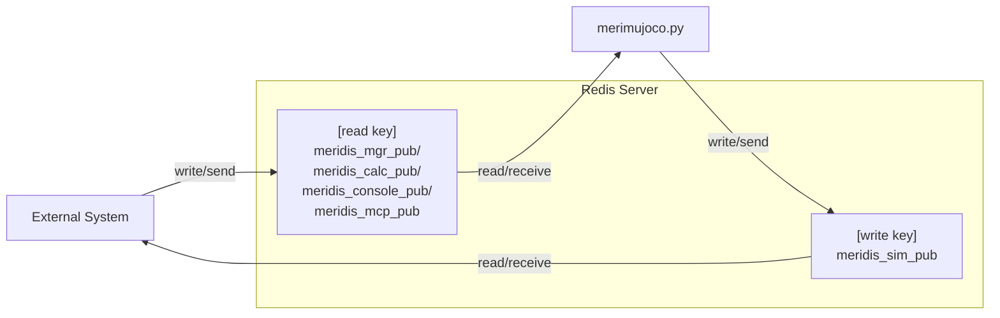

# merimujoco - Technical Specification

English / [Japanese](README_advance.md)

This document covers the detailed technical specification, configuration file structure, and customization options for **merimujoco**.  
If you want to extend the system or run it with custom settings, this is the place to start.
<BR>

---

## Specification

## Commands
```bash
# Launch with default settings
python merimujoco.py
```

**⚠️ Important: How to quit merimujoco**  
**Use the "×" button in the top-right of the window, or left menu `File` -> `Quit`.**

### Command Options
- `--redis <filename>`: Specify the Redis configuration JSON file (default: `redis.json`)
- `--getfoot <BOOL>`: Write foot-tip XYZ positions to Meridim90 `id47-49` (left) and `id77-79` (right) (default: `true`)
- `--gethand <BOOL>`: Write hand-tip XYZ positions to Meridim90 `id44-46` (left) and `id74-76` (right) (default: `false`)
- `--view <MODE>`: Specify the camera view mode (`fpv`: first-person view from the head-mounted camera `head_fpv`)
- `--sphere <X,Y,Z>`: Place a touch detection sphere at world coordinates (meters), e.g. `--sphere 0.2,-0.01,0.35`. When omitted, the sphere is hidden and Meridim90[80-83] remains 0.
- `--stream [HZ]`: Enable FPV offscreen rendering and publish the `head_fpv` camera image along with Meridim90 to the Redis key `meridis_frame_pub`. Optionally specify `HZ` to set the transmission rate in the range 1-100 Hz (default when omitted: 10 Hz). Requires `opencv-python` (`pip install opencv-python`).


---
### Configuration File Format

Redis connection settings are managed via JSON files.  
If no file is found, safe defaults (127.0.0.1:6379) are used.

```json
{
  "redis": {
    "host": "127.0.0.1",
    "port": 6379
  },
  "redis_keys": {
    "read": "meridis_mgr_pub",
    "write": "meridis_sim_pub"
  },
  "data_flow": {
    "redis_to_joint": false,
    "joint_to_redis": true
  }
}
```

#### Configuration Fields

- **redis**: Redis server connection settings
  - `host`: Hostname or IP address of the Redis server
  - `port`: Port number of the Redis server
- **redis_keys**: Redis keys for data exchange
  - `read`: Key to read command data from an external control system
  - `write`: Key to write simulation state data
- **data_flow**: Data flow control **[experimental]**
  - `redis_to_joint`: Apply values received from Redis to MuJoCo joints (code default: `true`; `redis.json` default: `false`)
  - `joint_to_redis`: Send MuJoCo joint angles to Redis (code default: `false`; `redis.json` default: `true`)

#### Differences Between Configuration Files

This repository includes 6 JSON configuration files for different use cases. All files share the same Redis connection settings (host: 127.0.0.1, port: 6379), but differ in `redis_keys` and `data_flow`.

| Filename | read key | write key | redis_to_joint | joint_to_redis | Use case |
|----------|----------|-----------|----------------|----------------|----------|
| [redis.json](redis.json) | `meridis_mgr_pub` | `meridis_sim_pub` | ❌ false | ✅ true | Default settings |
| [redis-mgr-direct.json](redis-mgr-direct.json) | `meridis_mgr_pub` | `meridis_sim_pub` | ❌ false | ✅ true | MuJoCo UI control |
| [redis-mgr.json](redis-mgr.json) | `meridis_mgr_pub` | `meridis_sim_pub` | ✅ true | ❌ false | Sim2Real / Real2Sim |
| [redis-calc.json](redis-calc.json) | `meridis_calc_pub` | `meridis_sim_pub` | ✅ true | ✅ true | Integration with motion generation programs (bidirectional) |
| [redis-console.json](redis-console.json) | `meridis_console_pub` | `meridis_sim_pub` | ✅ true | ❌ false | Control from console input [planned] |
| [redis-mcp.json](redis-mcp.json) | `meridis_mcp_pub` | `meridis_sim_pub` | ✅ true | ❌ false | Integration with MCP server [planned] |

---
## Technical Details

### Data Flow Diagram



### Joint Mapping

#### joint_names[] and XML joint names
- **Overview**: The `joint_names` list in `merimujoco.py` defines joint names indexed based on the actuator order in the MuJoCo model.
- **Note**: Even if the joint names in the loaded `roid1_mjcf.xml` do not match those in `joint_names[]`, MuJoCo's `data.ctrl` is indexed by the model's actuator order, so as long as the order of `joint_names` matches the XML actuator order, there is no issue.
- **Recommendation**: For readability, it is recommended to match the joint names in `joint_names[]` with the joint names in the XML file.

```python
joint_names = [
    "c_chest", "c_head", "l_shoulder_pitch", "l_shoulder_roll", "l_elbow_yaw", "l_elbow_pitch",
    "r_shoulder_pitch", "r_shoulder_roll", "r_elbow_yaw", "r_elbow_pitch",
    "l_hip_yaw", "l_hip_roll", "l_thigh_pitch", "l_knee_pitch", "l_ankle_pitch", "l_ankle_roll",
    "r_hip_yaw", "r_hip_roll", "r_thigh_pitch", "r_knee_pitch", "r_ankle_pitch", "r_ankle_roll"
]
```

#### joint_to_meridis[] and the meridis_sim_pub table
- **Overview**: The `joint_to_meridis` dictionary maps each joint name to an index and multiplier in the Meridis data array.  
  This allows joint angle data received from Redis to be correctly transformed and applied to `data.ctrl` in MuJoCo.
- **Structure**: Each entry is in the format `[index, multiplier]`
  - Index: position in the Meridis array
  - Multiplier: adjustment such as sign inversion
- **Purpose**: In Redis-based data exchange, converts command values from external control systems into joint control within the simulation.

```python
joint_to_meridis = {
    # Base link
    "base_roll":        [12, 1],
    "base_pitch":       [13, 1],
    "base_yaw":         [14, 1],
    # Head
    "c_head":           [21, 1],
    # Left arm
    "l_shoulder_pitch": [23, 1],
    "l_shoulder_roll":  [25, 1],
    "l_elbow_yaw":      [27, 1],
    "l_elbow_pitch":    [29, 1],
    # Left leg
    "l_hip_yaw":        [31, 1],
    "l_hip_roll":       [33, 1],
    "l_thigh_pitch":    [35, 1],
    "l_knee_pitch":     [37, 1],
    "l_ankle_pitch":    [39, 1],
    "l_ankle_roll":     [41, 1],
    # Chest
    "c_chest":          [51, 1],
    # Right arm
    "r_shoulder_pitch": [53, 1],
    "r_shoulder_roll":  [55,-1],
    "r_elbow_yaw":      [57,-1],
    "r_elbow_pitch":    [59, 1],
    # Right leg
    "r_hip_yaw":        [61,-1],
    "r_hip_roll":       [63,-1],
    "r_thigh_pitch":    [65, 1],
    "r_knee_pitch":     [67, 1],
    "r_ankle_pitch":    [69, 1],
    "r_ankle_roll":     [71,-1]
}
```

## Meridim90 Data Mapping

The main index reference for `meridis_sim_pub` (write key) written by merimujoco:

| Index | Content | Unit | Notes |
|-------|---------|------|-------|
| `id1` | Frame counter | - | Self-increments only when the receive counter has not been updated for 100 cycles; rolls over at 65535 |
| `id2` | IMU acceleration ax | m/s² | c_chest coordinate frame |
| `id3` | IMU acceleration ay | m/s² | c_chest coordinate frame |
| `id4` | IMU acceleration az | m/s² | c_chest coordinate frame |
| `id5` | IMU angular velocity wx | deg/s | c_chest coordinate frame |
| `id6` | IMU angular velocity wy | deg/s | c_chest coordinate frame |
| `id7` | IMU angular velocity wz | deg/s | c_chest coordinate frame |
| `id12` | IMU orientation roll | deg | c_chest |
| `id13` | IMU orientation pitch | deg | c_chest |
| `id14` | IMU orientation yaw | deg | c_chest |
| `id44` | Left hand-tip X | m | World coordinates (only valid with `--gethand true`) |
| `id45` | Left hand-tip Y | m | World coordinates (only valid with `--gethand true`) |
| `id46` | Left hand-tip Z | m | World coordinates (only valid with `--gethand true`) |
| `id47` | Left foot-tip X | m | Relative to left hip yaw axis center, zero-corrected (only valid with `--getfoot true`) |
| `id48` | Left foot-tip Y | m | Relative to left hip yaw axis center, zero-corrected (only valid with `--getfoot true`) |
| `id49` | Left foot-tip Z | m | Height from floor, zero-corrected (only valid with `--getfoot true`) |
| `id74` | Right hand-tip X | m | World coordinates (only valid with `--gethand true`) |
| `id75` | Right hand-tip Y | m | World coordinates (only valid with `--gethand true`) |
| `id76` | Right hand-tip Z | m | World coordinates (only valid with `--gethand true`) |
| `id77` | Right foot-tip X | m | Relative to right hip yaw axis center, zero-corrected (only valid with `--getfoot true`) |
| `id78` | Right foot-tip Y | m | Relative to right hip yaw axis center, zero-corrected (only valid with `--getfoot true`) |
| `id79` | Right foot-tip Z | m | Height from floor, zero-corrected (only valid with `--getfoot true`) |
| `id80` | Sphere status flag | - | See touch detection sphere section for bit definitions |
| `id81` | Sphere position X | m | `0.0` when `--sphere` is omitted |
| `id82` | Sphere position Y | m | `0.0` when `--sphere` is omitted |
| `id83` | Sphere position Z | m | `0.0` when `--sphere` is omitted |

---

## Machine Learning Options

The following features are useful for machine learning tasks such as imitation learning and reinforcement learning.

### Reset Function
- **Condition**: Receiving `data[0] == 5556` via Redis
- **Behavior**: Resets the MuJoCo simulation state (mj_resetData)
- **Use case**: Reinitializing control experiments, recovering from abnormal states

---

### FPV Streaming (`--stream [HZ]`)

- Useful for training VLA (Vision-Language-Action) models that determine robot behavior based on camera images and natural language instructions.
- When `--stream` is specified, the offscreen rendering from the `head_fpv` camera is published to Redis along with Meridim90 data.
- Append a number like `--stream 30` to set the transmission rate in the 1-100 Hz range. When omitted, the rate defaults to 10 Hz.

#### Camera Definition in Robot Model XML (required)

To use `--view fpv` and `--stream`, the MuJoCo model XML must define a camera named **`head_fpv`**.  
In `roid1_mjcf.xml`, it is defined as a child of the head body (`c_head`) as follows:

```xml
<!-- FPV camera: forward +X direction (Rx(π/2)·Ry(-π/2)), up +Z, eye position -->
<camera name="head_fpv" pos="0.015 0 0.025" euler="1.5707963 -1.5707963 0" fovy="80"/>
```

| Attribute | Value | Meaning |
|-----------|-------|---------|
| `name` | `head_fpv` | Camera identifier (**must not be changed** as `merimujoco.py` searches by this name) |
| `pos` | `0.015 0 0.025` | Mounting position in head body coordinates (meters) |
| `euler` | `1.5707963 -1.5707963 0` | Rotation Rx(π/2)·Ry(-π/2) to orient the view axis forward +X and up +Z |
| `fovy` | `80` | Vertical field of view (degrees) |

If the camera is not found, `--view fpv` will warn and fall back to the default viewpoint, and `--stream` will report an error and disable streaming.  
When using a custom model, add a camera element with the same `name="head_fpv"` to the XML.

#### Publish Target

| Item | Value |
|------|-------|
| Redis key | `meridis_frame_pub` |
| Publish rate | 1-100 Hz (10 Hz when `--stream` is used alone) |
| Resolution | 320×240 |
| Image format | JPEG (quality 80) |

#### Payload Format

```json
{
  "meridim90": [0.0, 123.0, ...],
  "frame": "<Base64-encoded JPEG>"
}
```

- `meridim90`: The Meridim90 array (all 90 elements) at the time of frame rendering. Guarantees that the image and robot state correspond to the same simulation step.
- `frame`: The JPEG image encoded as a Base64 string.
- The counter is included in `meridim90[1]`, so there is no separate `count` field.

#### FPV Viewer

A test viewer application for receiving and displaying FPV stream output from `merimujoco.py`:

```bash
python mrd_stream_viewer.py [--redis redis.json] [--key meridis_frame_pub] [--fps 30]
```

Displays the `meridim90[1]` counter value in the upper-left corner of the screen.

---

### Touch Detection Sphere (`--sphere`)

- A feature for detecting whether the robot's hands, feet, or body have approached or reached a target "touch detection sphere".
- Useful for VLA (Vision-Language-Action) training that determines robot behavior based on camera images and natural language instructions.

Specifying `--sphere X,Y,Z` places a sphere at the given world coordinates and detects contact with the robot.  
The sphere's state is written to Meridim90 `id80-id83` and notified to external systems via Redis.

#### Sphere Definition in Scene XML (required)

To display the touch sphere and use it for contact detection, the sphere must be defined in the MuJoCo scene XML.  
In the actual `roid1_mjcf/scene.xml`, the following body and geom are placed inside `worldbody`:

```xml
<!-- Touch detection sphere: world-fixed, hidden unless --sphere is specified. -->
<body name="touch_sphere_body" pos="0.05 0.0 -1.0">
  <geom name="touch_sphere" type="sphere" size="0.01" rgba="1 0 0 1" contype="1" conaffinity="1"/>
</body>
```

| Element | Value | Meaning |
|---------|-------|---------|
| `body name` | `touch_sphere_body` | Placement anchor in world coordinates. `merimujoco.py` rewrites this body's position to move the sphere. |
| `geom name` | `touch_sphere` | The sphere geometry. `merimujoco.py` searches by this name for display and contact detection. |
| `type` | `sphere` | Defined as a spherical geometry |
| `size` | `0.01` | Radius of 1 cm |
| `rgba` | `1 0 0 1` | Displayed in red. When `--sphere` is not specified, the code sets alpha to 0 to hide it. |
| `contype` / `conaffinity` | `1` / `1` | Enables contact detection with other geometries |

`merimujoco.py` searches for `touch_sphere` and `touch_sphere_body` by name at startup; if not found, the sphere cannot be displayed or repositioned.  
When using a custom model or scene, be sure to define at least `touch_sphere_body` and `touch_sphere` with those exact names in the XML.

#### Behavior When Sphere Is Not Found

At startup, `merimujoco.py` first searches for the `touch_sphere` geom and issues a warning if not found:

```text
touch_sphere geom not found in model
```

In this case, sphere display, contact detection, and hiding are all skipped. Even if `--sphere` is specified, since there is no actual geometry in the simulator, neither the visual nor the contact detection will work.

If `touch_sphere` geom exists but `touch_sphere_body` does not, the sphere itself exists but cannot be repositioned via `--sphere X,Y,Z`.  
In this case, the code skips body position rewriting, post-contact evacuation, and reset restoration under the condition `SPHERE_BODY_ID >= 0`.

In short, both of the following are required for correct operation:

- `geom name="touch_sphere"`: The actual sphere for display and contact detection
- `body name="touch_sphere_body"`: The parent body for sphere placement, movement, and reset restoration

#### Meridim90 Write Specification

| Index | Content | Notes |
|-------|---------|-------|
| `id80` | Sphere status flag | See bit definitions below |
| `id81` | Sphere position X (meters) | `0.0` when `--sphere` is omitted |
| `id82` | Sphere position Y (meters) | `0.0` when `--sphere` is omitted |
| `id83` | Sphere position Z (meters) | `0.0` when `--sphere` is omitted |

#### `id80` Bit Definitions

| Value | bit1 | bit0 | State |
|-------|------|------|-------|
| `0` | 0 | 0 | `--sphere` not specified (no sphere) |
| `1` | 0 | 1 | Sphere active, no contact |
| `3` | 1 | 1 | Sphere active, contact detected |

- **bit0**: Always set when `--sphere` is specified (sphere is active)
- **bit1**: Set on contact detection; cleared on system reset (both command and UI reset)

#### State Transitions

```
Startup (--sphere present)  →  id80 = 1
       ↓ contact detected
    id80 = 3  ← sphere moves to default position in XML model (hidden position)
       ↓ system reset (command or UI reset)
    id80 = 1  ← sphere returns to xyz position specified by --sphere
```

#### Dynamic Sphere Position Update (via read key)

When an external system sends `id80 == 1` along with new xyz values to the read key (e.g., `meridis_calc_pub`), `merimujoco.py` updates the sphere position in real time.

| Received `id80` | Behavior |
|-----------------|----------|
| `1` | Update sphere position with values in `id81-id83` and clear the contact flag (bit1) |
| Other | Ignore `id80-id83` (overwritten by the simulator's own values) |

- Since `id81-id83` are always output to `meridis_sim_pub` (write key), external systems can obtain the current sphere position without needing to know the `--sphere` argument separately.
- This feature is disabled when `--sphere` is not specified.
